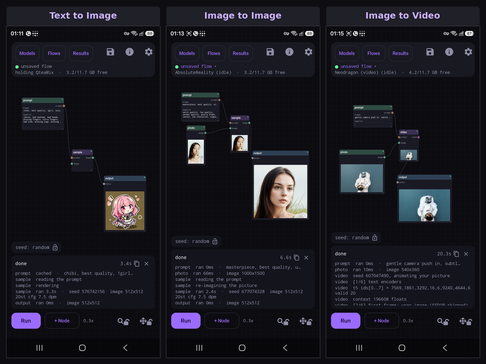

# Nightmare Mobile

**A node graph for image and video generation on Android, running entirely on the Qualcomm
Hexagon NPU.**

Text to image, image to image, inpainting, upscaling, FLUX.2 and Qwen Image editing and text
to video, all on the phone. No server, no account, no cloud, no network.

<p align="center">
  
</p>

**[Download the APK](https://github.com/AbrahamPaulJ/nightmare-mobile/releases/latest)** ·
**[User guide](https://abrahampaulj.github.io/nightmare-mobile/)**

Android 12 or newer, arm64, and a Snapdragon with a Hexagon NPU — SD 1.5 needs an 888 or
newer, SDXL and Anima an 8 Gen 3, and FLUX.2, Z-Image, Qwen Image and video an 8 Elite; Krea 2
also needs 16 GB of RAM. Models are not in the APK: pick one in the app and it downloads on first
use, and the app says which ones your phone can run.

**Keywords:** on device AI, offline Stable Diffusion, ComfyUI for Android, mobile Stable
Diffusion, local image generation, on device video generation, node editor, Qualcomm Hexagon
NPU, Snapdragon, QNN, FLUX.2, FLUX.2 Klein 9B, Z-Image, Qwen Image, Krea 2, SDXL, Anima, text to image, text to video, image to
video, img2img, inpainting, outpainting, virtual try-on, Segment Anything, SAM 2.1, npuforge,
safetensors to QNN, on device model conversion, offline prompt translation, no cloud, private.

## What it does

**A canvas built for a phone.** Big ports, snap to connect, pinch to zoom, and a node palette
in a sheet. Draw a graph, press Run, and the picture appears on the node that made it.

**Mix checkpoints in one graph.** Each generate node carries its own model, and the executor
orders the run so each checkpoint loads once. Generate with FLUX.2 and then repaint part of the
result with a dedicated inpainting checkpoint, in a single graph, with a single Run. The run
bar tells you what the model switches will cost before you press it.

**FLUX.2 Klein 4B and 9B, Z-Image Turbo, Qwen Image 2.1 and Krea 2 Turbo on the NPU.** DiT
models at any width and height from 512 to 2048 in 64 pixel steps — 1280x960 and 1344x768 as
readily as 1024 square. Changing the size costs no reload. Snapdragon 8 Elite or newer.

**FLUX.2 Klein 9B** is the bigger Klein: the same editing and LoRAs as the 4B, with an 8B text
encoder. It is 10.7 GB and tight on a 12 GB phone, so it starts at 768 square (about a minute
a picture); 1024 works but may be closed by Android when other apps hold memory. **Krea 2
Turbo** is text to image only and needs a phone with 16 GB of RAM: on 12 GB it does not load; on a
24 GB OnePlus 13 a user measured about 2 min 40 s a picture.

**Qwen Image 2.1.** A 7B image model with an 8B vision-language model reading the prompt, so
it follows long instructions and can put legible text in a picture. It generates and it edits:
its text encoder sees the photos you give it, not just their latents. It is 10.8 GB, so on a
12 GB phone it loads one part at a time and gives each back before the next. That makes it
slower than FLUX.2 (about 4 minutes for a 1024 square picture on an 8 Elite, longer for an
edit), and worth it when the prompt is hard.

**A real inpainting model.** AbsoluteReality Inpaint is a 9 channel checkpoint: the model sees
the hole it is filling and the pixels around it, instead of repainting blind and being blended
back afterwards. It sits among the SD 1.5 models and does text and image to image too.

**Tap to select.** Tick `Enable tap to select` in the mask editor, tap the thing you want
redone, and the mask follows its outline. That is Segment Anything 2.1, an 87 MB download that
the same checkbox offers, running on the phone's CPU.

**Auto mask.** Tick `Enable auto mask` and pick what to repaint by name — Clothes, Face, Hair,
Shoes or Bag. The flow remembers the choice and masks every new photo by itself, so a photo in
and Run is the whole job. It is an ATR human parser (SegFormer-B2, int8), a 29 MB download,
on the CPU; a chip that finds nothing says so rather than guessing. `Enable auto crop` in the
crop window does the same for framing: the whole photo, fitted.

**Add Objects.** Paste a real object from another photo into the one you are repainting, and
only its edges are repainted so it blends in while its middle stays pixel exact. Choose the
object by painting over it, then drag it into place, resize and turn it with two fingers, flip
or rotate it. Each Add is its own layer above the photo, up to two, and the mask stays on the
photo's layer.

**Outpainting.** An inpaint frame may zoom out past the photo, up to twice its area, and the
padding is generated. What fills it first is your choice: black, the photo's own edges blurred,
or pure green (`#00FF00`) for an outpaint LoRA trained on a green screen. An image edit gets the
same with `Allow padding` in its crop window.

**Image editing with FLUX.2 Klein or Qwen Image 2.1.** A photo and a prompt: the whole
picture is re-rendered to follow it rather than nudged, so the composition survives and the
content changes. Wire a second picture into the reference port and name them as image 1 and
image 2 in the prompt to compose the two. Needs a Snapdragon 8 Elite or newer. FLUX.2 is the
fast one (6.2 GB); with FLUX.2 a reference is encoded at your output size rather than its own,
so 512x512 is the size to use when you wire one in.

**Text to video.** A prompt in, 49 frames at 1024x640 out, about two seconds of clip in about
25 seconds on an 8 Elite. Image to video animates a photo instead, using the same three nodes
with a photo wired in. The clip loops on the node that made it and plays full screen. Needs a
Snapdragon 8 Elite or 8 Elite Gen 5 and about 8.6 GB of models, and the app checks your chip by
running a small real model on it rather than by reading its name.

**Recipes to start from.** Text to image, image to image, inpainting, upscaling, image edit
and both video flows, each laid out so no wire crosses and the whole graph fits the screen
when it opens. They are listed from the least demanding to the most, and one your phone
cannot run says so instead of opening.

**Move between nodes without leaving the sheet.** Open a node and every node in the flow is
a card along the top, in the order the graph runs. Tap one, or swipe sideways, and the
inspector slides to the next. The crop and mask editors open over the picture and close with
a drag downward.

**Download from a mirror.** Every model file comes from Hugging Face by default, and Settings
can point that at hf-mirror.com or any base address you give it. One setting covers the
checkpoints, the upscalers, the segmenter, the translation models and the video weights — for anywhere huggingface.co
is slow or unreachable.

**Keep models where you can see them.** By default models live in the app's private storage.
Settings can move them to `Download/Nightmare`, where any file manager reaches them and they
survive uninstalling the app. That needs All files access, which is asked only if you choose
it. Loading speed is the same either way.

**Batching.** Arm `seed`, `steps`, `cfg`, `denoise` or `scheduler` on a generate node and Run
sweeps them. Two knobs at once gives you a grid. Every run is kept with the exact graph that
produced it, so a picture you like can be reopened as the flow that made it.

**Upscalers.** RealESRGAN x4plus anime and 4x UltraSharp V2 Lite, loaded per request so they
cost no restart, or bring your own converted `.bin`. Enlarging is a checkbox on the output node
rather than a node of its own, and that node then shows what it received above what it made,
each with its own buttons.

**Thirty-three checkpoints, or bring your own.** Six SD 1.5, three SD 1.5 Swap, ten SDXL, nine
Anima and five DiT in the catalogue. Import a converted checkpoint as a zip, or convert one on the phone with
[npuforge](https://github.com/AbrahamPaulJ/npuforge), which turns an SD safetensors checkpoint
into a QNN model with no PC involved; its 9 channel inpainting exports run as real inpainting
models, its v-prediction exports automatically select the backend's v-prediction mode, and its
**SD1.5 Swap** exports take LoRAs and ControlNet per render (below). A model with a file deleted says which one and offers Repair. Every generate node has its own checkpoint picker,
grouped by family and listing what is actually installed; switching family rewrites that node
and keeps every wire. The APK carries every Hexagon architecture tier and picks the build your
chip can load.

**Pick your size.** SD 1.5 renders any resolution its checkpoint ships a patch for, from 512
square up to 1024, portrait and landscape. SDXL and Anima crop their fixed canvas to the shape
you choose. The DiT models take two sliders and render the size you ask for directly, and drop
a photo on one and it sizes itself to that photo's shape.

**A DiT fine-tune imports as-is.** FLUX.2, Z-Image and Krea 2 build their graph at load time
from plain weights, so a checkpoint from CivitAI or Hugging Face — `.safetensors` or `.gguf` — is
picked from storage and runs, no conversion, no PC. Klein 4B and Z-Image imports share the text
encoder, VAE and tokenizer with the model you already installed; Klein 9B and Krea 2 imports get
their own copy. A file too big for the phone's RAM is flagged on its row before you run it. A folder copied onto the phone works too — the
family is read out of the checkpoint's own tensor names, so nothing has to be declared. A folder
that already carries LocalDream's marker file — `SDXL`, `ANIMA`, `KLEIN`, `ZIMAGE`,
`QWEN_IMAGE_2_1`, `npucustom` or `finished` — is taken at its word, so a model directory assembled for that app imports here
unchanged.

**LoRAs, swappable per render.** Import an adapter `.safetensors` and pick it on any FLUX.2 or
Z-Image generate node — a checkbox per installed file and a strength slider. It binds while the
render starts, so changing one or moving a slider reloads nothing. The cost is the adapter's
size: about 6% for a 160 tensor FLUX adapter, 43% for a 480 tensor Z-Image one. Stack as many
as you like.

**SD 1.5 Swap: LoRA, ControlNet and IP-Adapter on the NPU, per render.** Convert an SD 1.5
checkpoint in npuforge as *SD1.5 Swap* and it becomes a model whose LoRA, ControlNet and (since
npuforge 1.0.7) IP-Adapter are inputs rather than baked-in weights. Pick LoRAs on its node the same way (several are merged into its one
rank-64 slot on the phone, once, then cached), and give it a ControlNet picture: **canny**
finds the edges of a photo on the phone, **openpose** finds the pose in a photo (a 19 MB
detector in Models → Tools, MoveNet) or takes a ready-made skeleton as it is, and **depth** makes
a depth map from a photo (Depth Anything V2 Small, 99 MB, about 1 s on an 8 Elite) or takes a
ready-made one. The ControlNets themselves are our own QNN builds, downloaded in the app in the
tier your chip loads — [`AbrahamPJ/nightmare-sd15-controlnet-qnn`](https://huggingface.co/AbrahamPJ/nightmare-sd15-controlnet-qnn):
all three for 8 Gen 2 and newer; canny and depth also as a slower compatibility build for the 888 / 8 Gen 1 (not yet tested on one).
The control picture is an image node **wired into the sampler**: switching ControlNet on wires
the node's own photo in (it follows the crop window, so the hint lines up), or adds an image node
when there is none; a different picture goes in its own node, with its own crop drawn over the
photo. Two **Advanced** flows open with LoRA, ControlNet and IP-Adapter ready and switched off. **SD 1.5 Swap Inpaint** repaints a masked area
with the same LoRAs and ControlNet (a blend inpaint: the model does not see the mask, so a big
fill can leave a soft seam). Nothing is reconverted and the model is not
reloaded. 512×512 only; about 15% slower than the same checkpoint converted plainly, and a
ControlNet adds about 3 s a picture. ControlNet adds about 30 ms a step. Only the
UNet half of a LoRA applies, as with every NPU conversion.

**IP-Adapter: a reference picture steers the render.** On a Swap model converted with npuforge
1.0.7 or later (and the two defaults), pick a picture on the node's **IP-Adapter** tile or wire one
into **reference**: **Plus** carries its subject and style into the picture, **Plus Face** a face.
The picture is read once on the phone's CPU (CLIP ViT-H, about 6 s on an 8 Elite; 1.3 GB to
download, Face another 50 MB), then a strength change or a new prompt costs nothing. It stacks
with LoRAs and ControlNet. A Swap model converted earlier keeps working, without a reference.

**Embeddings.** Import a textual inversion `.safetensors` and name it in a prompt.

**English, Chinese and Russian.** The interface follows your phone's language. Adding another
is a file drop: copy `app/src/main/res/values/strings.xml` into a `values-<code>/` folder and
translate it, with no code changes.

**Prompts in Russian or Chinese.** SD 1.5 and SDXL only read English, so a prompt box holding
Cyrillic or Chinese text shows a translate button. One tap turns it into English and the same
button undoes it. Weights like `(long hair:1.2)` and English tags pass through untouched. It
runs offline on the phone with Mozilla's Firefox Translations models (37 MB for Russian, 55 MB
for Chinese, downloaded the first time you tap), about 15 ms a prompt. Settings manages them.

**Your RAM back when you leave.** Close the app — swipe it from recents or back out — and the
loaded model is let go at once. Step away to another app and it stays a minute so a quick
trip costs no reload, then goes (sooner if the phone runs short); a render you step away
from is never interrupted. Settings has
LocalDream's low RAM switches for SDXL and Anima, set from how much memory your phone has: on
under 16 GB, off above it for speed and a live preview.

**Offline and private.** Nothing is uploaded, there is no account, and no prompt or picture
leaves the phone. The only thing that ever does is a file you explicitly share.

## Under the hood

A generate node is one node to you, and several ops underneath. `encode_text`, `vae_encode`,
`sample`, `latent_blend` and `vae_decode` are separate endpoints on the inference server, and
conditionings and latents move between them as handles that never cross the wire, so a 512
image costs about 40 bytes of JSON instead of 780 KB. A plugin reaches the ops; a person
reaches the nodes.

The node set is deliberately small. Cropping, masking, encoding, sampling, blending and
decoding happen inside the generate node, because an NPU has no runtime compiler and the inside
of a compiled pipeline cannot be recombined on the phone anyway. Inpainting used to take ten
nodes and now takes four.

## Writing a node (experimental)

Contributors can add a node without an app release: a JSON manifest plus a small JavaScript
file, zipped and pushed to the app's plugin directory. No toolchain and no compile step. Four
worked examples, from a one op wrapper to a multi node toolkit, are in
[`examples/`](examples/).

This is early. The plugin format can still change between versions, there is no host op yet
that lets a node run a model of its own, and an imported script should be treated like any
other code you did not write. Read an example in `examples/` for the manifest shape and the
image and latent ops a node can call.

## Building it

JDK 17 and Android SDK 35.

```
gradlew assembleDebug
```

The NPU backend is a native binary, and the QNN runtime libraries are not in this repository.
Without them the app builds and the canvas works, but nothing renders.

Prompt translation needs Foxlet built once: `tools/build_foxlet.sh` (from Git Bash) clones it
beside this repository, builds it from source and copies the AAR into `app/libs/`. The app
does not compile without it.

## Credits

**The NPU work is not ours.** This app forks the C++ inference server from
[xororz/local-dream](https://github.com/xororz/local-dream), which is where the QNN pipelines,
the model conversions, the per chipset build tiers and the device gating all come from. The
checkpoint and upscaler archives the app downloads are published by the same author. Anyone
interested in how Stable Diffusion runs on a Hexagon NPU at all should start there rather than
here.

**FLUX.2, Z-Image, Qwen Image and Krea 2 run on work by [happyyzy](https://github.com/happyyzy/stable-diffusion.cpp).**
The DiT engine is [leejet's stable-diffusion.cpp](https://github.com/leejet/stable-diffusion.cpp)
with happyyzy's Hexagon optimisations for on device DiT inference, the same engine local-dream
3.0 ships, and it is what makes these models usable on a phone at all. The Qwen3 text encoder
and the DiT VAEs were converted by
[zhiyuanasad](https://huggingface.co/zhiyuanasad/flux2_klein_adreno). The models themselves are
[FLUX.2 klein 4B](https://huggingface.co/black-forest-labs/FLUX.2-klein-4b-fp8) by Black Forest
Labs and [Z-Image Turbo](https://huggingface.co/Tongyi-MAI/Z-Image-Turbo) by Tongyi-MAI, with
fp8 weights by [Kijai](https://huggingface.co/Kijai/Z-Image_comfy_fp8_scaled).
[Qwen Image 2.1](https://huggingface.co/Qwen/Qwen-Image-2.1) is by the Qwen team under the
Qwen Research License, in [leejet's GGUF](https://huggingface.co/leejet/Qwen-Image-2.1-GGUF)
with the VAE from [Comfy-Org](https://huggingface.co/Comfy-Org/Qwen-Image-2.1); its text encoder
is [Qwen3-VL-8B-Instruct](https://huggingface.co/Qwen/Qwen3-VL-8B-Instruct) (Apache 2.0) in
[bartowski's GGUF](https://huggingface.co/bartowski/Qwen_Qwen3-VL-8B-Instruct-GGUF).
[FLUX.2 klein 9B](https://huggingface.co/black-forest-labs/FLUX.2-klein-9B) is by Black Forest
Labs under the FLUX Non-Commercial License, in
[leejet's GGUF](https://huggingface.co/leejet/FLUX.2-klein-9B-GGUF), with
[Qwen3-8B](https://huggingface.co/Qwen/Qwen3-8B) (Apache 2.0) in
[bartowski's GGUF](https://huggingface.co/bartowski/Qwen_Qwen3-8B-GGUF) as its text encoder.
[Krea 2 Turbo](https://huggingface.co/krea/Krea-2-Turbo) is by Krea: Krea 2 is licensed under
the Krea 2 Community License Agreement; see https://krea.ai/krea-2-licensing. It runs from the
[gguf-org MXFP4 GGUF](https://huggingface.co/gguf-org/krea-2-gguf) with
[Qwen3-VL-4B-Instruct](https://huggingface.co/Qwen/Qwen3-VL-4B-Instruct) (Apache 2.0) in
[bartowski's GGUF](https://huggingface.co/bartowski/Qwen_Qwen3-VL-4B-Instruct-GGUF) and the
Wan 2.1 VAE from [Comfy-Org](https://huggingface.co/Comfy-Org/Wan_2.1_ComfyUI_repackaged).

**The video is not ours either.** It is
[Neodragon](https://huggingface.co/Qualcomm-AI-Research/Neodragon) by Qualcomm AI Research,
released under BSD-3-Clause-Clear with additional terms on the model card. The pyramidal
schedule, the autoregressive MMDiT loop and the streaming VAE decode are theirs, and the NPU
conversions this app runs were made from their weights. The first frame comes from
[SSD-1B](https://huggingface.co/segmind/SSD-1B) by Segmind.

**Tap to select and auto mask** run
[SAM 2.1](https://github.com/facebookresearch/sam2) hiera-tiny by Meta (Apache 2.0) and
[SegFormer-B2 fine-tuned on ATR](https://huggingface.co/mattmdjaga/segformer_b2_clothes) by
mattmdjaga (MIT), both converted to ONNX for the phone.

**Prompt translation** is [Foxlet](https://github.com/yinvoke/foxlet-translate) by yinvoke,
built from source: Mozilla's Bergamot engine and Marian with ARM int8 kernels. The
Russian and Chinese models are Mozilla's
[Firefox Translations](https://github.com/mozilla/firefox-translations-models) models, unmodified.

**AbsoluteReality Inpaint** is Lykon's inpainting checkpoint, converted for LocalDream.

**SD 1.5 Swap** models are made by [npuforge](https://github.com/AbrahamPaulJ/npuforge); the two
defaults are Lykon's AbsoluteReality v1.8.1, kemiaomiao's CuteYukiMix and Yuno779's Anything V5,
under their authors' terms. Their ControlNets are our QNN builds of
[lllyasviel's ControlNet 1.1](https://huggingface.co/lllyasviel/ControlNet-v1-1) (canny, depth,
openpose; CreativeML OpenRAIL-M), hosted at
[`AbrahamPJ/nightmare-sd15-controlnet-qnn`](https://huggingface.co/AbrahamPJ/nightmare-sd15-controlnet-qnn).
IP-Adapter is Tencent AI Lab's [IP-Adapter Plus and Plus Face](https://huggingface.co/h94/IP-Adapter)
(Apache 2.0) with the OpenCLIP ViT-H/14 image encoder (MIT), converted to ONNX and hosted at
[`AbrahamPJ/nightmare-ip-adapter`](https://huggingface.co/AbrahamPJ/nightmare-ip-adapter).
The hint makers are [MoveNet MultiPose Lightning](https://huggingface.co/Xenova/movenet-multipose-lightning)
by Google (Apache 2.0) with LocalDream's OpenPose renderer, and
[Depth Anything V2 Small](https://huggingface.co/onnx-community/depth-anything-v2-small)
(Apache 2.0).

[LocalDream](https://github.com/AbrahamPaulJ/dreamui) is the consumer app built on the same
backend, and it stays the simpler way to generate a picture on a phone.

What is new here is the graph: pipelines decomposed into ops, latents and conditionings as
handles, node types a contributor can add without an app release, and the video path taken
apart into the same kind of nodes as the picture one.

## Licence

**CC BY-NC 4.0**, inherited rather than chosen. This project derives from
[xororz/local-dream](https://github.com/xororz/local-dream), which is released under that
licence, and it continues under the same terms. No further restrictions are added here.

Share it, fork it, build on it. Do not sell it or ship it inside something you sell.

Full text in [LICENSE](LICENSE); attribution and third party components in [NOTICE](NOTICE).

The Qualcomm AI Runtime libraries the app needs at runtime are covered by Qualcomm's own terms,
which this licence does not override. They are not in this repository.

## Something failed?

Tap the **share** icon on the red error message: it shows a full report — the error, the
backend's log and how it stopped, your phone and model files, never your prompt — to copy or
share as a `.txt`. Attach it to an [issue](https://github.com/AbrahamPaulJ/nightmare-mobile/issues).
More in the [troubleshooting guide](https://abrahampaulj.github.io/nightmare-mobile/troubleshooting/).

## Support

[buymeacoffee.com/abrahampaulj](https://buymeacoffee.com/abrahampaulj)

Tips are welcome and change nothing: the app stays free, offline and CC BY-NC, and nothing is
gated behind them. A donation is not a purchase of the software and does not grant commercial
rights the licence withholds.
