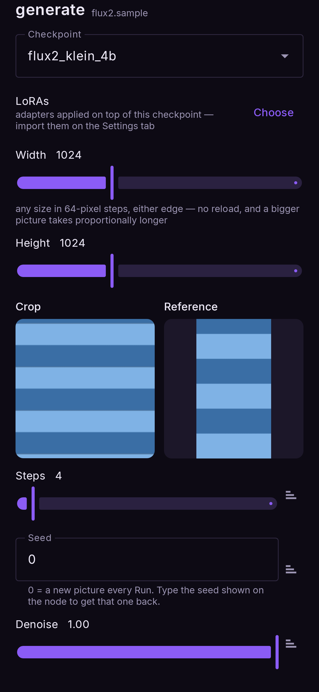

# Image edit

*A photo and a prompt: the whole picture is re-rendered to follow it, rather than nudged.*

**Nodes:** Prompt and Image → Image edit → Output. **Needs a Snapdragon 8 Elite or newer** and
one of the edit models: **FLUX.2 Klein** (4B or 9B) or **Qwen Image 2.1**.

Where [Image to image](image-to-image.md) repaints a photo loosely, an edit model reads the
photo as a reference and follows an **instruction**: the composition survives, the content
changes. *Make it winter*, *turn the car red*, *put a hat on the dog*.

## Steps

1. Install **FLUX.2 Klein** or **Qwen Image 2.1** under Models (see below for which).
2. **Flows → Image edit.** With Qwen selected in Models, it opens as a Qwen edit; otherwise as
   FLUX.2.
3. Tap the **image** node and choose the photo.
4. Write the instruction in the **prompt**: `make it a snowy winter evening`.
5. **Run.**

## FLUX.2 or Qwen?

| | FLUX.2 Klein 4B | Qwen Image 2.1 |
|---|---|---|
| Download | 6.7 GB | 10.8 GB (13.8 GB FP8 on a 16 GB phone) |
| Speed (edit, 8 Elite) | about a minute at 512 | about 14 minutes at 1024 |
| Strength | Fast, good at style and scene changes | Follows long instructions; reads the photo with a vision model; can write legible text |
| Best size | **512 × 512** with a reference (see below) | smaller sizes are much faster |

Start with FLUX.2. Reach for Qwen when FLUX.2 does not understand what you asked.

## Two pictures: the reference port

The Image edit node has a second input, **reference**. Wire another Image node into it and
you can combine two pictures: in the prompt, the base photo is **image 1** and the reference is
**image 2** — `put the jacket from image 2 on the person in image 1`.

<figure markdown>
  { .screen }
</figure>

You can also wire **only** a reference and no base photo: *generate something new, guided by
this picture*.

!!! warning "Keep FLUX.2 at 512 with a reference"
    With FLUX.2, a reference is processed at your **output** size, not its own. On a 12 GB
    phone a 1024 × 1024 edit with a reference runs out of memory; 512 × 512 finishes in about
    a minute. The Reference tab warns you when the size is too big. For Qwen, reference editing
    is new — please report how it goes.

## Denoise and padding

- An edit starts at **denoise 1.0**: the full schedule runs and the photo guides it as a clean
  reference. Lower values start from the photo itself and change less.
- **Allow padding** in the crop window lets the frame zoom out past the photo; the empty part
  is filled with the **Pad** choice (black, blur, or green for an outpaint LoRA) and generated.
