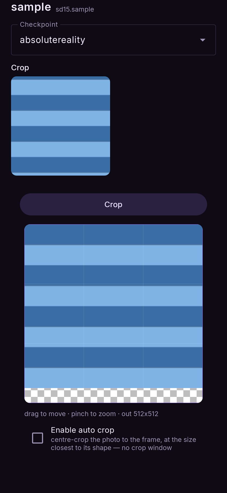

# Image to image

*A photo from the gallery, re-imagined at the strength you choose.*

**Nodes:** Prompt and Image → Image to image → Output.

Use it to restyle a photo (a painting of it, an anime version), or to take a rough picture
and let the model redraw it with more detail.

!!! note "FLUX.2 and Qwen Image use Image edit instead"
    These two are edit models: give them a photo and they re-render it to follow an
    instruction. That is its own flow — see [Image edit](image-edit.md).

## Steps

1. **Flows → Image to image.**
2. Tap the **image** node and choose a photo. It appears on the node straight away.
3. Tap the **prompt** node and describe the result you want — describe the *whole* picture, not
   just the change.
4. Tap the **Image to image** node and set **Denoise** (below).
5. **Run.**

## Denoise: how much changes

**Denoise** runs from 0 to 1:

| denoise | result |
|---|---|
| 0.2 – 0.4 | Close to the photo: colours and details shift, the composition stays |
| 0.5 – 0.7 | A real reinterpretation that keeps the layout (0.65 is the default) |
| 0.8 – 1.0 | Mostly new; the photo only guides the overall shapes |

## Framing the photo

The generator draws at a fixed size and shape, so the photo is **framed** to that shape first.
Tap the picture on the generator node (or **Crop** in its sheet) to open the framing view:
drag the photo to move it and pinch to zoom; the frame is exactly what will be sent.

You can also zoom *out* past the photo's edges (up to twice its area), which makes the subject
smaller in the frame. The part outside the photo shows as a **checkerboard**: the model sees it
filled with the photo's own edges, mirrored and blurred, but it is **cut away from the result**,
so only the photo's own area comes back. The photo is never stretched.

<figure markdown>
  { .screen }
  <figcaption>Zoomed out a little: the checkerboard strip is not part of the result.</figcaption>
</figure>
