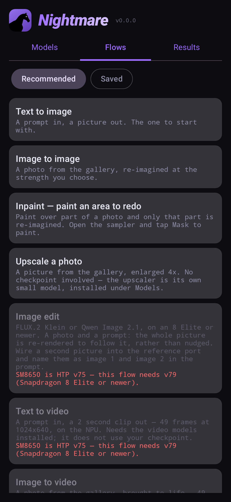

# Flows

A **flow** is a ready-to-run arrangement of nodes for one job. Open **Flows** at the top of
the screen: **Recommended** holds the flows that ship with the app, **Saved** holds yours.
Tap a card to open it on the canvas — it replaces what is there, so save first if you want to
keep the current one.

<figure markdown>
  { .screen }
  <figcaption>Recommended flows, from the least demanding to the most.</figcaption>
</figure>

The list is ordered by **what the flow asks of your phone**, lightest first:

| flow | what it does | needs |
|---|---|---|
| [Text to image](text-to-image.md) | A prompt in, a picture out | any model |
| [Image to image](image-to-image.md) | A photo re-imagined at the strength you choose | any SD 1.5 / SDXL / Anima / Z-Image model |
| [Inpaint](inpaint.md) | Redo only the area you paint | SD 1.5, SDXL or Anima |
| [Upscale a photo](upscale.md) | A picture enlarged up to 4× | an upscaler (8–24 MB) |
| [Image edit](image-edit.md) | A photo changed to follow an instruction | FLUX.2 or Qwen Image, 8 Elite |
| [Text to video](video.md) | A prompt in, a 2-second clip out | the video models, 8 Elite |
| [Image to video](video.md#image-to-video) | A photo brought to life | the video models, 8 Elite |

A flow your phone cannot run is **shown dimmed** and says why — the chip it has and the one it
needs — instead of opening and failing later.

<figure markdown>
  { .screen }
</figure>

## The model a flow uses

A flow opens with the model you have selected in **Models** when that model fits the job, and
otherwise with an installed model that does. You can change it on the generator node itself:
tap the node, then **Checkpoint**. Each generator carries its own model, so one flow can use
two — for example generate with FLUX.2, then repaint part of the result with an inpainting
model. The app loads each model once per Run and tells you before you press Run if it will have
to switch.

## Your own flows

- **Save**: the 💾 button at the top of the canvas. The name is pre-filled.
- **Open**: Flows → **Saved**, tap the card. The pencil renames it, the bin deletes it (it asks
  first).
- **Share and import**: a flow is a small `.json` file. **Import a flow** at the bottom of the
  Flows tab opens one someone sent you.
- **From a result**: every picture in [Results](../reference/results.md) remembers the flow that
  made it — open it from there to get the exact settings back.

## Batching

Any flow can be run many times with a setting varied each time — every seed from 1 to 8, or a
grid of steps × CFG. See [Batching](batch.md).
