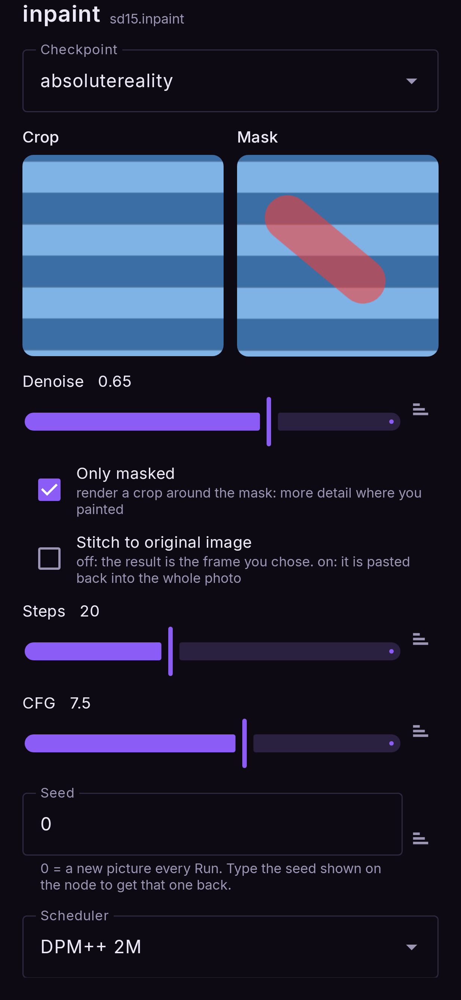
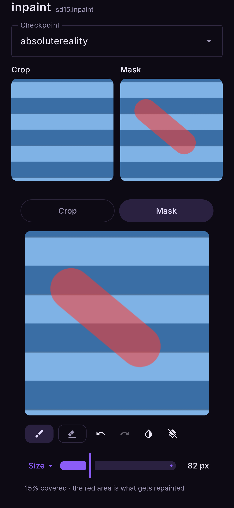
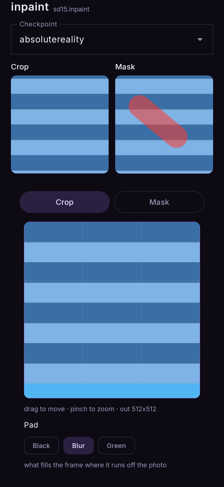

# Inpaint

*Paint over part of a photo and only that part is re-imagined.*

**Nodes:** Prompt and Image → Inpaint → Output.

Remove something, replace it, change clothes, fix a face, or extend the photo past its edges
(outpainting).

## Steps

1. **Flows → Inpaint — paint an area to redo.**
2. Tap the **image** node and choose the photo.
3. Tap the **Inpaint** node. Its sheet shows two small pictures, **Crop** and **Mask**.
4. Tap **Mask** and paint over what you want redone (details below). Pull the window down to
   close it.
5. Write the prompt: describe **what should be in the painted area**, in the context of the
   whole picture — `a red leather jacket` rather than `change the jacket`.
6. **Run.**

<figure markdown>
  { .screen }
  <figcaption>The sheet: Crop and Mask, with the settings below.</figcaption>
</figure>
<figure markdown>
  { .screen }
  <figcaption>The mask editor. Red is what gets repainted.</figcaption>
</figure>

## Which model to use

Any SD 1.5, SDXL or Anima model inpaints. **AbsoluteReality Inpaint** (in Models → SD 1.5) is
a dedicated inpainting model: it sees the hole and the pixels around it, so the new part fits
better, especially for large areas. Use it when you can. An SD 1.5 Swap or SDXL Swap model
converted in npuforge with **Inpaint** ticked is one too.

**Z-Image**, **Qwen Image** and **Krea 2** inpaint as well, by redrawing the area around your
mask at the **Denoise** strength and blending the result back along the mask. They do not see
the hole the way an inpainting model does, so they are best for changing what is there
(Denoise 0.5–0.8) rather than filling a large empty area. FLUX.2 does not inpaint yet.

## The mask editor

| tool | does |
|---|---|
| 🖌 **Paint** | Paint the area to redo. Pinch to zoom in for precise edges |
| **Erase** | Remove paint |
| ↶ ↷ | Undo / redo a stroke |
| ◑ **Invert** | Swap painted and unpainted — "redo everything except this" |
| **Clear** | Remove all paint |
| **Size** | Brush size in pixels |

The line under the tools says how much of the picture is covered.

### Tap to select

Tick **Enable tap to select** in the Inpaint sheet (the first time, it offers an 87 MB
download). In the mask editor, tap an object and the mask follows its outline. Tap it again
to take more of it, and once more to let it go. This is Segment Anything 2.1, running on the
phone's CPU.

### Auto mask

Tick **Enable auto mask** (a 29 MB download) and chips appear in the mask editor:
**Clothes**, **Face**, **Hair**, **Shoes**, **Bag**. Tap one and that part of the person is
masked. The flow **remembers** the choice and masks every new photo by itself — for example a
clothes-swap flow where you only change the photo and press Run.

After a tap or a pick, **Grow** widens or narrows the selected area, and **Feather** softens its
edge.

## Only masked, and Stitch to original image

- **Only masked** (on by default): the model works on a crop around your mask rather than the
  whole photo, so the painted area gets far more detail. Leave it on for small areas.
- **Stitch to original image** (off by default): off, the result is the frame you chose; on, the
  repainted area is pasted back into the full-size original photo.

## Outpainting: extending the photo

In the **Crop** view you can zoom *out* past the photo's edges (up to twice its area). The empty
part is generated. What fills it before generation is the **Pad** choice:

| pad | use it for |
|---|---|
| **Black** | Plain extension; the model invents everything |
| **Blur** | The photo's own edges, blurred — a smoother start for scenery |
| **Green** (`#00FF00`) | Outpaint LoRAs trained on a green screen |

<figure markdown>
  { .screen }
</figure>

## Tips

- Paint a little **beyond** the edge of the thing you are replacing, so the model can blend it.
- If the result ignores your prompt, raise **denoise**; if it changes too much around the edge,
  lower it or tighten the mask.
- To paste in a real object from another photo instead of generating one, see
  [Add Objects](add-objects.md).
