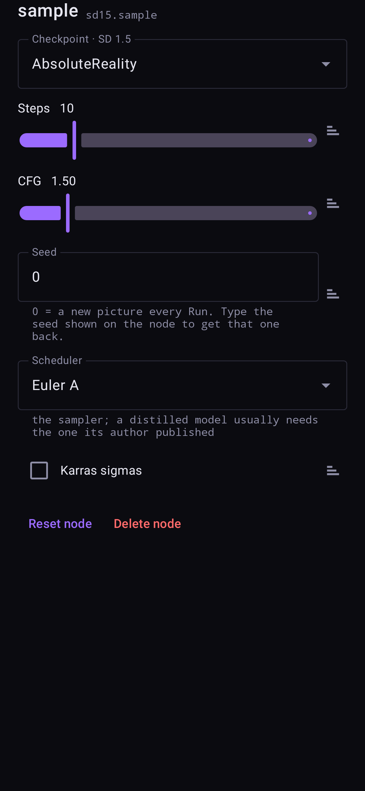
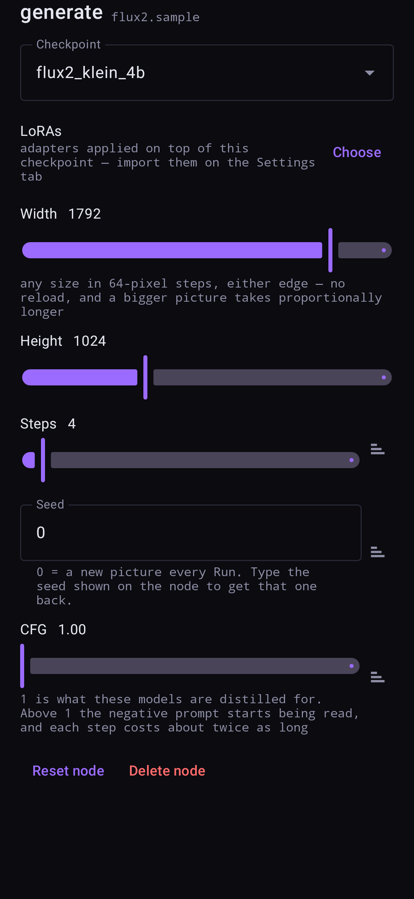

# Text to image

*A prompt in, a picture out. The one to start with.*

**Nodes:** Prompt → Text to image → Output.

## Steps

1. **Flows → Text to image.**
2. Tap the **prompt** node and write what you want, and what you do not want in **Negative**.
3. Optional: tap the **Text to image** node to choose the model, the size and the sampling
   settings (below).
4. **Run.** The picture lands on the output node and in Results.

## Writing prompts for each model family

The model families read prompts differently:

| family | write it as | example |
|---|---|---|
| SD 1.5, SDXL | short tags, most important first | `portrait of an old sailor, weathered face, rim light, 35mm` |
| Anima | anime-style tags | `1girl, silver hair, school uniform, cherry blossoms` |
| FLUX.2, Z-Image, Qwen Image | plain sentences | `An old sailor smiling at the camera, late afternoon light behind him.` |

- For SD 1.5 and SDXL you can weight a phrase: `(red scarf:1.3)` for more, `(hat:0.7)` for
  less.
- FLUX.2, Z-Image and Qwen Image are run at **CFG 1**, where the **negative prompt is not read
  at all**. Put what you want in the prompt instead.
- A prompt in **Russian or Chinese** can be translated to English on the phone with the
  **文A** button on the prompt box (SD 1.5 and SDXL only read English). See
  [Settings → Translation](../reference/settings.md#translation).

## The generator's settings

Tap the **Text to image** node:

<figure markdown>
  { .screen }
</figure>

| setting | what it does | tip |
|---|---|---|
| **Checkpoint** | The model | Grouped by family; only installed models are listed |
| **Steps** | How many refinement passes | More is slower; each model opens on the number its author recommends |
| **CFG** | How strictly the prompt is followed | Too high burns colours; turbo/distilled models want ~1–2 |
| **Seed** | The starting noise | `0` = a new picture every Run. Type a seed shown on a node to get that picture back |
| **Scheduler** | The sampling method | A distilled model usually needs the one its author published |
| **Karras sigmas** | A different noise schedule | Try it for smoother detail on SD models |
| **Resolution** / **Shape** / **Width, Height** | The picture's size | Depends on the family — below |

### Size, per family

- **SD 1.5** — pick a **Resolution** from the sizes the model supports (512 square up to 1024,
  portrait and landscape). A different size reloads the model on the next Run.
- **SDXL and Anima** — these draw a fixed 1024 square; **Shape** crops it to the aspect you
  choose. No reload.
- **FLUX.2, Z-Image, Qwen Image** — **Width** and **Height** sliders, any size from 512 to 2048
  in 64-pixel steps. No reload. Bigger takes longer, roughly in proportion to the area.

<figure markdown>
  { .screen }
</figure>

## How long it takes

Roughly, on a Snapdragon 8 Elite:

| family | a 1024-ish picture |
|---|---|
| SD 1.5 (512) | a few seconds |
| SDXL, Anima | tens of seconds to over a minute |
| FLUX.2 Klein (4 steps) | under a minute |
| Qwen Image 2.1 (20 steps, 1024²) | about 4 minutes |

The first Run after choosing a model also loads it, which adds a few seconds (more for the
large ones).
