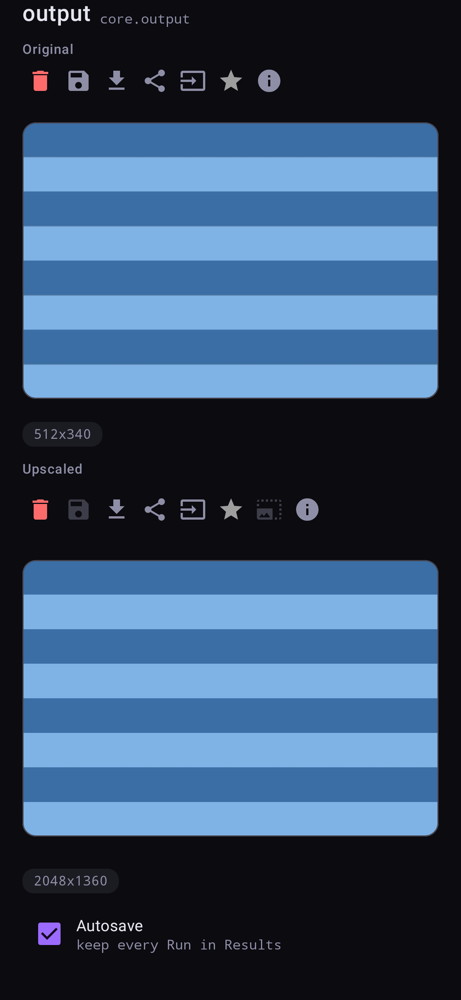

# Upscale a photo

*A picture from the gallery, enlarged. No checkpoint involved — the upscaler is its own small
model.*

**Nodes:** Image → Output, with **Auto upscale** ticked on the output.

## First: install an upscaler

**Models → Upscalers.** Two are offered, 8–24 MB each:

| upscaler | best for |
|---|---|
| **RealESRGAN x4plus anime** | Drawings, anime, flat colour |
| **4x UltraSharp V2 Lite** | Photos |

You can also import your own converted upscaler (a `.bin` file) there.

## Steps

1. **Flows → Upscale a photo.**
2. Tap the **image** node and choose the picture.
3. Tap the **output** node: **Auto upscale** is ticked. Choose the **upscaler** and the
   **scale** (2×, 3× or 4×).
4. **Run.**

The output node shows what it received **above** what it made, each with its own save and share
buttons.

<figure markdown>
  { .screen }
</figure>

!!! info "The 4096-pixel limit"
    A result may not exceed 4096 pixels on its longer side. If the scale you chose would pass
    that, the largest scale that fits is used instead, and the app tells you. Scales that would
    not fit are dimmed in the chooser.

## Upscaling any flow's result

**Auto upscale** is a checkbox on every output node, so any flow can enlarge its own result:
tick it on the output of a Text to image flow and each picture comes out bigger.

## Upscaling something you already made

In **Results**, open a picture and tap the **upscale** button. The enlarged picture is kept as a
new item and the original stays.
