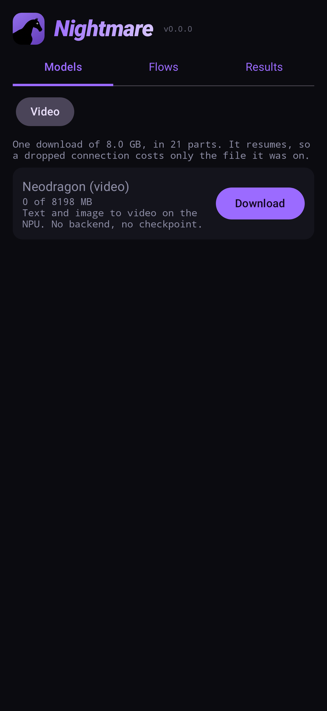
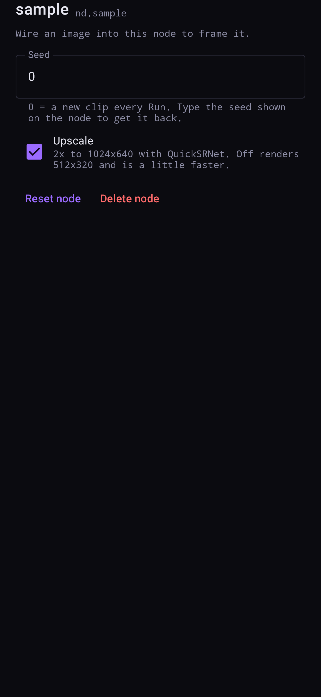

# Video

*A prompt in, a two-second clip out — 49 frames at 1024 × 640, on the NPU.*

**Needs a Snapdragon 8 Elite or 8 Elite Gen 5** and the video models (about 8.6 GB). It does
not use your picture model; the video has its own.

## Install the video models

**Models → Video → Download.** The download is 21 files; it resumes, so a dropped connection
only costs the file it was on. Use Wi-Fi.

Before offering the download, the app checks your chip by **running a tiny real model on it**,
rather than trusting its name. If that check fails, the row says your device cannot run it.

<figure markdown>
  { .screen }
</figure>

## Text to video

**Nodes:** Prompt → Video → Output.

1. **Flows → Text to video.**
2. Write the prompt: describe the scene *and the motion* — `waves rolling onto a beach at
   sunset, camera slowly panning right`.
3. **Run.** About 25 seconds on an 8 Elite.

The clip **loops on the node** that made it; tap it to play it full screen. With **Save** on
(the default), an MP4 is also written to `Movies/Nightmare`.

## Image to video

**Nodes:** Prompt and Image → Video → Output — the same flow with a photo wired in.

1. **Flows → Image to video.**
2. Choose the photo on the **image** node. It is framed to the video's shape; drag and pinch
   in the framing view to choose the part that is animated.
3. Describe the motion you want, and **Run**. About 20 seconds.

## Video settings

| setting | does |
|---|---|
| **Seed** | `0` = a new clip every Run; type a seed shown on the node to get that clip back |
| **Upscale** | On: 2× to 1024 × 640. Off: 512 × 320, a little faster |
| **Save** (output) | Writes an MP4 to `Movies/Nightmare`, which outlives the app's cache |

<figure markdown>
  { .screen }
</figure>
