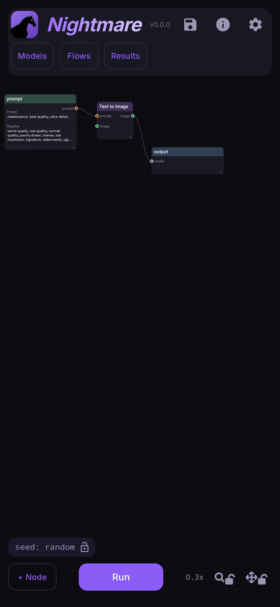

# Nightmare user guide

**Nightmare makes pictures and short videos on your phone, with no internet and no account.**
Everything runs on the Snapdragon's NPU (its AI chip). You describe what you want, press
**Run**, and the picture appears on the screen a few seconds to a few minutes later,
depending on the model.

It works a little differently from most apps: every job is a small **flow** of boxes
(**nodes**) joined by lines (**wires**) — a prompt box, a generator, an output. You never have
to build one from scratch: the app ships ready-made flows for every job, and you can just open
one and press Run. When you want more control, the same boxes let you see and change every
step.

!!! note "This guide is a work in progress"
    It covers everything the app does today, but some pages are still thin and the
    screenshots are drawn by the app itself rather than taken from a real phone, so pictures
    show as plain colour blocks. Corrections and requests are welcome on
    [GitHub](https://github.com/AbrahamPaulJ/nightmare-mobile/issues).

<figure markdown>
  { .screen }
  <figcaption>The first screen: a Text to image flow, ready to run.</figcaption>
</figure>

## Where to start

- **New here?** Start with [Install and check your phone](start/install.md), then
  [Your first picture](start/first-picture.md). Ten minutes, most of it the download.
- **Want a specific job?** [Flows](flows/index.md) has a page for each: edit a photo, redo
  one area, enlarge, make a video.
- **Looking up a setting?** The [Reference](reference/index.md) explains every node, knob and
  Settings switch.
- **Something went wrong?** [Troubleshooting](troubleshooting.md) covers the common failures.

## What it can do

| job | flow | page |
|---|---|---|
| A picture from a description | Text to image | [Text to image](flows/text-to-image.md) |
| Re-imagine a photo | Image to image | [Image to image](flows/image-to-image.md) |
| Redo one area of a photo, or extend it | Inpaint | [Inpaint](flows/inpaint.md) |
| Paste an object from another photo, blended in | Inpaint + Add Objects | [Add Objects](flows/add-objects.md) |
| Make a photo bigger and sharper | Upscale a photo | [Upscale](flows/upscale.md) |
| Change a photo by instruction ("make it winter") | Image edit | [Image edit](flows/image-edit.md) |
| A two-second clip from text or a photo | Text / Image to video | [Video](flows/video.md) |
| Try many seeds or settings at once | any flow + Batch | [Batching](flows/batch.md) |

## What your phone needs

- **Android 12 or newer**, and a **Snapdragon** processor. Other chips (Exynos, Tensor,
  MediaTek) have no supported NPU and cannot run it.
- Which models you can use depends on the chip:

| chip | can run |
|---|---|
| Snapdragon 888 and newer | SD 1.5 models, upscaling |
| Snapdragon 8 Gen 3 and newer | + SDXL and Anima |
| Snapdragon 8 Elite and newer | + FLUX.2, Z-Image, Qwen Image, video; Krea 2 with 16 GB of RAM |

- **Storage**: models are downloaded separately, from about 1 GB (an SD 1.5 model) to
  13.8 GB (Qwen Image on a 16 GB phone). The app tells you each size before you download.
- **Memory**: 8 GB of RAM runs the SD 1.5 models; 12 GB runs everything but Krea 2, some of
  it slowly (FLUX.2 Klein 9B starts at 768 to stay inside it); Krea 2 needs 16 GB.

The app checks your chip itself and says plainly when a model or flow cannot run on it.

## Privacy

Nothing you type or make leaves the phone. There is no account, no analytics and no upload.
The app only goes online to download a model you asked for, and a picture only leaves when you
share it yourself.
