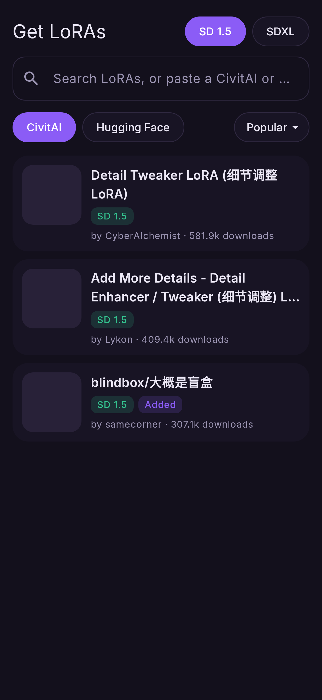
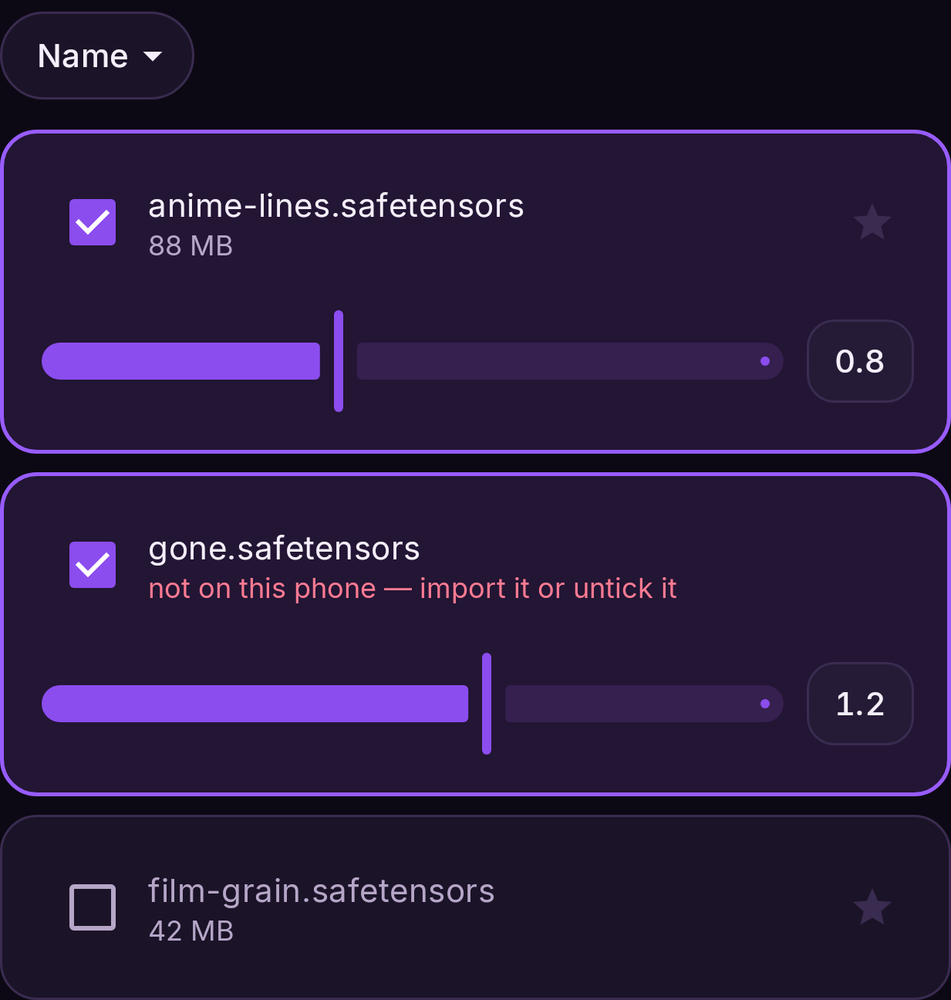

# LoRAs and embeddings

Two kinds of small add-on file change what a model draws without replacing it.

## LoRAs

A **LoRA** is a small adapter (usually tens to hundreds of MB) that teaches a model a style, a
character or a concept. In Nightmare, LoRAs work on **FLUX.2**, **Z-Image**,
**SD 1.5 Swap** (an SD 1.5 checkpoint converted in npuforge as *SD1.5 Swap*) and
**SDXL Swap** (an SDXL checkpoint converted in npuforge 1.0.10 or newer as *SDXL Swap*, with
LoRA ticked; 1.0.11 offers LoRA as SDXL Swap's only feature).

### Download from CivitAI or Hugging Face

On an **SD 1.5 Swap** or **SDXL Swap** generator node, open **LoRAs** and tap **Search
online**. The **Get LoRAs** sheet opens on the most popular LoRAs for that node's family.

<figure markdown>
  { .screen }
</figure>

- **SD 1.5 / SDXL** at the top picks the family. SDXL includes Illustrious, Pony and NoobAI
  LoRAs, which all run on SDXL Swap.
- **Type to search.** Results update as you type. You can also paste a CivitAI model link or a
  Hugging Face repo link to open that LoRA directly.
- **CivitAI / Hugging Face** picks the site, and **Popular ▾** sets the order (Popular, Top
  rated, Newest).
- Tap a LoRA to see its versions (on Hugging Face, its files). Each one shows its size,
  base model and trigger words. **Download** saves it straight into your LoRAs. The bar
  shows progress and **Cancel** stops it. The file is checked against the hash CivitAI
  publishes, and the trigger words become the LoRA's note.

**CivitAI needs your API key for most downloads.** It's free: civitai.com → Account settings →
API Keys. Paste it in the box shown in the sheet, or in **Settings → Models → CivitAI**. The key
stays on your phone and is sent only to CivitAI. **Show mature content** (off by default)
searches civitai.red, which includes NSFW LoRAs.

!!! note "CivitAI search is blocked in some countries"
    In Australia, for example, CivitAI refuses searches, and the sheet tells you so. Pasting
    a CivitAI model link still works, and downloads still work with your key. You can also use
    Hugging Face or a VPN.

Only LoRAs for SD 1.5 Swap and SDXL Swap are offered here. LoRAs for FLUX.2 and Z-Image are
imported as files (below).

### Import

**Settings → Models → LoRAs → Import**, and pick the `.safetensors` file. It is listed with
its size; the bin deletes it. The **Files** button in a node's LoRA list does the same.

### Use

1. Tap a FLUX.2, Z-Image, SD 1.5 Swap or SDXL Swap generator node.
2. Under **LoRAs**, tick the ones you want — a checkbox per installed file.
3. Set each one's **strength** with its slider (1.0 is the adapter's full effect).
4. Run.

<figure markdown>
  { .screen }
</figure>

You can stack as many as you like. A LoRA is applied when the render starts, so switching one
on or off, or moving its slider, **reloads nothing**. It does cost render time, in proportion to
its size: about 6% for a typical FLUX.2 adapter, around 40% for a large Z-Image one.

If the LoRA's description names a trigger word, put that word in your prompt.

### In the prompt: `<lora:name:0.8>`

A prompt copied from CivitAI often names its LoRAs inline, as `<lora:name:0.8>`. Nightmare reads
those tags: each is taken **out of the prompt** before it reaches the text encoder, and if the name
matches a LoRA you have installed (with or without `.safetensors`), it is applied at that weight on
top of the node's LoRA list — the tag wins if both name the same one. A tag for a LoRA you do not
have, or any tag on a model that takes no LoRAs, is skipped and the run log says so. Tags do not
count toward the prompt's token limit.

### Sort, filter and favourites

With two or more LoRAs, the list has a **sort** menu — **Name**, **Newest**, **Most used** (how
often you tick it) or **Size** — and chips for each **base model** found among your files (SD 1.5,
SDXL, FLUX, Z-Image, Qwen), the node's own first. The base is read from the file itself and shown
under each name. Tap the **star** to make a LoRA a favourite: favourites come first. With eight or
more, a search box filters by name. The LoRAs ticked on the node always stay at the top, in the
order they are applied.

### Notes

The **⋮** beside each LoRA opens a note for it: its trigger words, the strength and settings it
works best with, anything you would otherwise have to remember. Put the **trigger words on the
first line**. A LoRA downloaded with **Search online** comes with its trigger words already
filled in. In the note:

- **Copy** copies the whole note.
- **Add to prompt** adds the first line to the end of the prompt wired into that generator.
- **Replace prompt** replaces that prompt's text with the first line.

A dot beside the ⋮ marks a LoRA that has a note. Notes are kept next to the LoRA files, so they
stay when the app is updated.

### Delete

**Delete** in a LoRA's ⋮ removes the file from the phone, after asking. If the LoRA was ticked
on that node, it is unticked too. Any other node that uses it will refuse to run until you add
it again or untick it. **Settings → Models → LoRAs** deletes LoRAs too.

### On SD 1.5 Swap

An SD 1.5 Swap model has room for ONE rank-64 adapter per layer, so the LoRAs you tick are
**merged** into it on the phone the first time that mix is used — about 10 s for one large
LoRA, 25 s for two — and kept for next time. With a single LoRA the strength slider is free;
changing the strengths of several makes a new merge. A LoRA trained above rank 64 is reduced to
its best rank-64 version. Only the part of a LoRA that changes the image model applies; the
part trained into the text encoder does not (true of every NPU conversion).

### On SDXL Swap

The same, with **SDXL** LoRAs: an SDXL Swap model has 700 rank-64 slots, filled on the phone the
first time a mix is used and kept for next time. LoRAs written with either layer naming
(diffusers or SGM) are read. From npuforge 1.0.12 an SDXL Swap conversion can also keep
ControlNet and IP-Adapter ([nodes](../reference/nodes.md#image-generator)), as the default
Illustrious XL Swap does; npuforge's SDXL Swap
conversion takes about an hour on the phone.

## Embeddings

An **embedding** (textual inversion) is a tiny file holding one trained concept — often a
style, or a "negative" such as a quality fix.

**Settings → Prompts → Embeddings → Import**, pick the `.safetensors`, and then **name it in
a prompt** (or the negative prompt) to use it.
