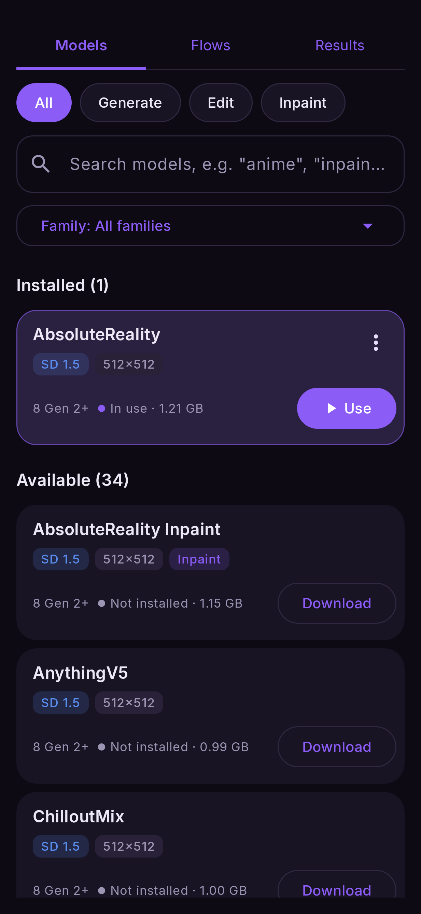

# Download, switch and delete

Open **Models**. Along the top are chips by what a model does — **All**, **Generate**, **Edit**,
**Inpaint**, then **Video**, **Upscalers** and **Tools** — with a search box under them
(try `anime`, `inpaint`, `flux`) and a **Family** menu that opens one family's own page, with
its typical size and anything to know before downloading.

The list has three parts: **Installed** (the model in use first), **Available**, and, folded
away at the bottom, **Not for this phone** — models your chip or RAM cannot run.

## Reading a card

Each card shows the model's name, coloured badges (family, size, *Inpaint* for a dedicated
inpainting model, *Imported* for your own), and a status line: the chip it needs, a dot and a
word, and the size.

| status | meaning | button |
|---|---|---|
| ● **In use** · 1.21 GB | Installed and selected | **Use** (opens a flow with it) |
| ● **Installed** · 1.21 GB | Installed, not selected | **Use** |
| ● **Not installed** · 1.15 GB | Available to download | **Download** |
| ● **Incomplete** | A file is gone (deleted, or a download broke) | **Repair** (in ⋮) |

**⋮** holds **Delete** (not offered for the model in use) and **Repair**.

## Download

Tap **Download**. The row shows the size, a progress bar and **Cancel**. Models are large —
use Wi-Fi. If Hugging Face is slow or blocked where you are, change the download source in
[Settings → Downloads](../reference/settings.md#download-source).

## Use

**Use** selects the model: new flows open with it, and the generator nodes on the canvas
switch to it (keeping every wire). Each generator node can also have its own model — tap the
node and pick under **Checkpoint**.

## Delete

**⋮ → Delete** asks first, and tells you how many MB it frees and how much it would cost to
download again. Deleting the model in use selects another one.

## Repair

A model with a missing file says which one, and **Repair** downloads just that file — not the
whole model.

<figure markdown>
  { .screen }
</figure>

## Where models are kept

By default, in the app's private storage — nothing else can see them, and **uninstalling the app
deletes them**. Settings can move them to `Download/Nightmare`, where file managers can reach
them and they survive an uninstall; loading speed is the same. See
[Settings → Models folder](../reference/settings.md#models-folder).
