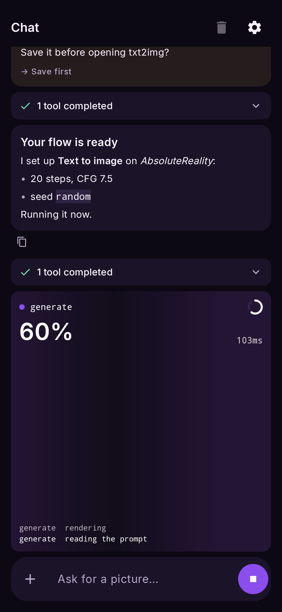
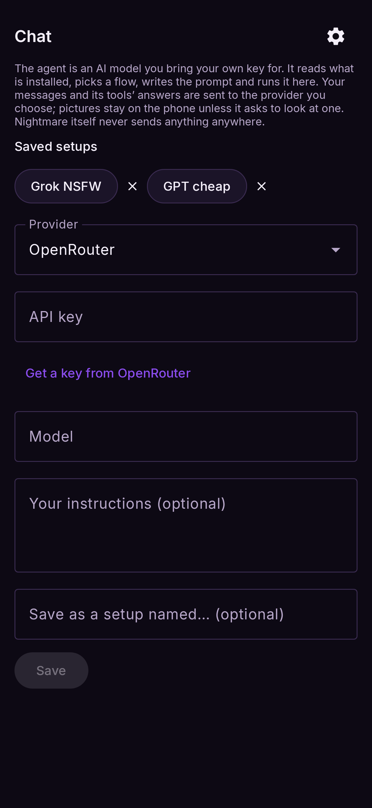
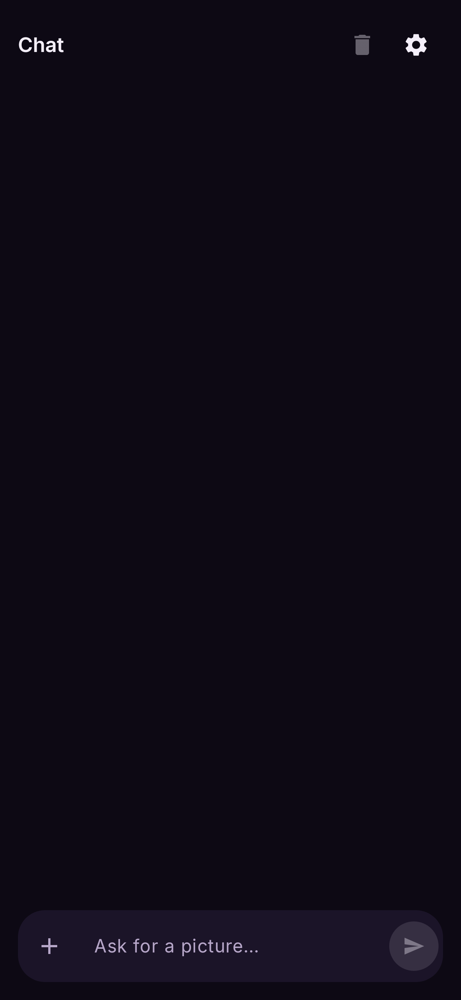

# Chat

Ask for pictures in words. The agent behind the chat is an AI model **you bring your own key
for**: it looks at what is installed, picks a flow and a model, writes the prompt, runs it on your
phone, and shows you the picture in the chat — tell it what to change and it edits the flow and
runs again. It never sends your pictures to the AI model. Open it with **Chat** at the top, beside
**Default** and **Advanced** — switch to either to see the flow it built; the chat stays where
you left it.

<figure markdown>
  { .screen }
</figure>

## Setting it up

The first time, the agent shows its setup (the ⚙ brings it back):

- **Provider** — OpenRouter (one key, hundreds of models), OpenAI, DeepSeek, xAI, Groq, or
  **Other** for any OpenAI-compatible address, such as `llama-server` or LM Studio on your PC.
- **API key** — from the provider's site (**Get a key from …** opens it). It is stored
  encrypted with Android's keystore and never shown again; leave the field empty to keep it.
- **Model** — start typing in the box and pick from the provider's models as they filter. The
  model must support **tool calling**; it does not need to see pictures.
- **Your instructions** (optional) — added to the agent's own: a style, a language, what is fine.
- **Save as a setup named…** (optional) — keep this provider, model, key and instructions under a
  name; **Saved setups** at the top of the setup switches between them.

<figure markdown>
  { .screen }
</figure>

## Starting a chat

Just say what you want. Ask for a picture ("a watercolour fox in snow") and the agent builds the
flow and runs it, with the run shown in the chat as the picture's frame and its log as it goes. Ask about the flow on the canvas
("make it 3:4 and darker", "add a pixel-art LoRA") and it changes that flow. Say "set up" or
"don't run" and it builds the flow and stops, so you can check it and press Run yourself.

<figure markdown>
  { .screen }
</figure>

## What it can do

| it can | how |
|---|---|
| open a flow, or change the one on the canvas | any setting of any node, the model, the prompt; it can add, wire and remove nodes |
| save the flow and press Run | exactly as you would — the result lands on the output node and in **Results** |
| find and download LoRAs | searches CivitAI (or Hugging Face) for your model's family, downloads one and uses it with its trigger words |
| delete a LoRA | asks you first |
| rework a result | feeds it into image to image |
| look at a result | only with a model that can see pictures |
| find the settings people use with a checkpoint | reads CivitAI: base model, trigger words, sampler, steps, CFG and example prompts from its most-liked pictures |

Its answers are formatted (headings, lists, code); the tools it used fold into one line per
answer — tap to see them. Every message has a copy button. **Run** sits at the bottom of the
Chat view too, and opens the **Default** view on the output, where the picture appears.

Before it replaces a flow with **unsaved changes**, it asks: **Save first**, **Discard** or
**Cancel**. **Stop** ends its turn, answers any question with Cancel and stops a render in
flight. The bin clears the chat.

Scroll up to re-read and the chat stays put: replies that arrive meanwhile show as a
**N new messages** button, which takes you to the first of them.

## Attaching a picture

**+** beside the message box attaches a picture. The phone describes it and tags it (with the
describe models, if installed) and tells the agent what it shows; the agent then uses it where
the flow needs it — the photo to rework, a ControlNet picture, an IP-Adapter reference. The
picture itself stays on the phone.

## Privacy

Your messages and the tools' answers (the list of your models and flows, render results) go
to the provider you chose — that is how it thinks. Pictures stay on the phone unless the agent
asks to look at one. Nothing else leaves the phone, and without a key nothing is sent at all.

What the agent will write is up to the model, its provider and your instructions — adult and NSFW
requests included. Nightmare holds one line itself, whatever the model: no sexual content
involving minors.
