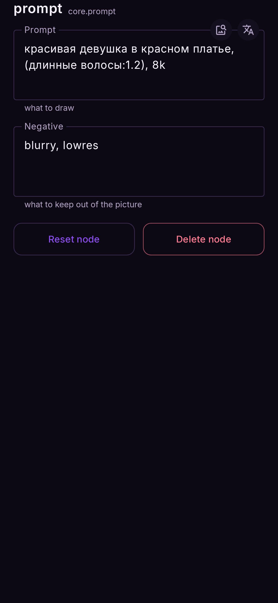

# Nodes and their settings

There are five kinds of node. Every flow — ready-made or yours — is built from these.

| node | palette tab | inputs | output |
|---|---|---|---|
| [Prompt](#prompt) | Common | — | prompt |
| [Image](#image) | Common | — | image |
| [Image generator](#image-generator) | Generate | prompt, image (+ reference, + control) | image |
| [Inpaint generator](#inpaint-generator) | Inpaint | prompt, image | image |
| [Video generator](#video-generator) | Generate | prompt, image | video |
| [Output](#output) | Common | media | — |

Every node's sheet ends with **Reset node** (all settings back to default) and **Delete node**.
Double-tap a node's name in its sheet to rename it.

---

## Prompt

Holds the text. Both boxes are shown on the node itself; tap one to edit it.

| setting | what it does |
|---|---|
| **Prompt** | What to draw |
| **Negative** | What to keep out of the picture (ignored at CFG 1 — FLUX.2, Z-Image, Qwen Image) |

A token count under each box tells you how much of the model's prompt limit you have used.
While you edit a box, a row of buttons under it works on the tag your cursor is in: **↑** and
**↓** make it heavier or lighter by 0.1 (written `(tag:1.1)`; back at 1.0 the brackets go),
**✕** deletes it, **+** starts a new tag after it, and the two arrows at the end undo and redo.
If the prompt is in **Russian or Chinese**, a **文A** button translates it to English on the
phone; the same button undoes it. See [Settings → Prompts → Translation](settings.md#translation). While you type, **tag autocomplete** offers matching tags under the box ([Settings → Prompts → Tag autocomplete](settings.md#tag-autocomplete)).

The **picture button** on the prompt box writes a prompt from a picture. Pick one already on the
canvas (an image node's photo, or what an output node made) or **From your phone**, and what to
write:

| | writes | for | model, time |
|---|---|---|---|
| **Short** | one sentence | photo models, SDXL, FLUX.2 | Florence-2 PromptGen, about 4 s |
| **Detailed** | a paragraph — subject, clothes, pose, light, background | the same | Florence-2 PromptGen, about 4–5 s |
| **Tags** | Danbooru tags, the character if it knows them, and a rating | Illustrious, Anima, Pony | WD tagger, about 1 s |

It opens on **Tags** when the prompt feeds an anime checkpoint and on **Detailed** otherwise. An
empty prompt is filled straight away; otherwise you see the result and choose **Add after your
prompt** or **Replace your prompt**. Each model (548 MB and 378 MB) is offered the first time
you need it and listed in [Models → Tools](../models/manage.md). Sentences can get details wrong;
for anime, Tags is the accurate one. Nothing is filtered, and nothing leaves the phone.

<figure markdown>
  { .screen }
</figure>

## Image

A photo from your gallery. Tap **Choose** to pick one (**Change** once there is one) — it opens
your phone's **photo picker** (on a phone without one, your **Gallery** app, which may ask for
the Photos and videos permission); **Files** beside it opens the file browser instead, for a
picture that is not in your gallery. It appears on the node straight away, no Run needed. The
picture's own buttons swap it or clear it.

<figure markdown>
  { .screen }
</figure>

## Image generator

The node that makes the picture. Its **title follows what is wired into it**:

| wired in | title |
|---|---|
| prompt only | *Text to image* |
| prompt + image | *Image to image* — or *Image edit* on FLUX.2 and Qwen Image |
| prompt + reference | *Image edit* (FLUX.2 and Qwen Image); on SD 1.5 Swap the title stays — the reference is IP-Adapter's picture |

The palette card is **Image** with a chip per family — **SD 1.5**, **SD 1.5 Swap**, **SDXL**,
**SDXL Swap**, **Anima**, **FLUX.2**, **Z-Image**, **Qwen Image**. The family decides which settings appear.

| setting | families | what it does |
|---|---|---|
| **Checkpoint** | all | The model. Switching family rewrites the node and keeps its wires |
| **Steps** | all | Refinement passes. Opens on the model's own recommended value |
| **CFG** | all | How strictly the prompt is followed. FLUX.2, Z-Image and Qwen are made for **1** — above 1 the negative prompt is read, but the picture burns quickly |
| **Seed** | all | `0` = a new picture every Run. Type a seed shown on a node to get that one back |
| **Scheduler** | all | The sampling method; a distilled model usually wants its author's choice. DiT models always use Euler |
| **Hires fix** | SD 1.5, SDXL (not inpaint) | After the render, enlarge it ×2 with your first upscaler and redraw the detail with [UltraFix](results.md#ultrafix) — one Run, a picture twice the size. Uses UltraFix's last Steps / Denoise steps. On the Snapdragon 8 Elite: SD 1.5 512 → 1024 about 16 s in all, SDXL 1024 → 2048 about 2½ min. Needs an upscaler installed; without one the render is kept and a warning says why |
| **Karras sigmas** | SD 1.5, SDXL, Anima | An alternative noise schedule (not with LCM) |
| **Denoise** | with an image | How much of the photo is replaced — 0 keeps it, 1 replaces it. Image to image opens at 0.65, Image edit at 1.0 |
| **Resolution** | SD 1.5 | The sizes this model supports. A new size reloads the model on the next Run |
| **Shape** | SDXL, Anima | Crops the fixed 1024 square to an aspect. No reload |
| **Width**, **Height** | FLUX.2, Z-Image, Qwen | 512–2048 in 64-pixel steps. No reload |
| **LoRAs** | FLUX.2, Z-Image, SD 1.5 Swap, SDXL Swap | Adapters on top of the model, each with a strength. [LoRAs](../models/loras.md) |
| **ControlNet** tile | SD 1.5 Swap, SDXL Swap | Type (**canny**, **depth**, **openpose** or none), strength, and the picture — always an image node wired into **control**: switching a type on wires the node's own photo in (image to image) or adds an image node (text to image); **Replace** puts a different picture in its own node, **none** removes the wire. The node's own photo follows its **crop window**; any other picture has its own **Crop** (drawn over the photo, shaped like the render, zoomable out past its edges). An empty picture is skipped with a warning. Canny finds the edges; openpose finds the pose in a photo (the **Pose Detector**, 19 MB) or uses a skeleton as it is; depth makes a depth map from a photo (the **Depth Estimator**, 99 MB, about 1 s) or uses a ready-made one. Each ControlNet (SD 1.5 about 370 MB, SDXL about 1.3 GB, 8 Gen 3 and newer) and each estimator is a download offered on the tile and in Models → Tools; a ControlNet not yet built for your chip says so. On an SDXL Swap conversion made without ControlNet the tile is dimmed and says why: of the defaults, **Illustrious XL Swap** has ControlNet and IP-Adapter (a copy downloaded before 1.6.122 does not — delete it and download it again) and **Juggernaut XL Swap** has LoRA only. The tile shows what the ControlNet sees; **⬇** above that picture saves it to the gallery |
| **IP-Adapter** tile | SD 1.5 Swap (npuforge 1.0.7+ and the defaults), SDXL Swap (npuforge 1.0.12+ with IP-Adapter ticked, and the Illustrious XL Swap default) | A reference picture the render follows — an image node wired into **reference**, added when you pick **plus** or **face** (**none** removes the wire), with its own **Crop** over the photo (shaped like the render; an empty picture is skipped with a warning). **plus** carries its subject and style, **face** a face; strength 0–1.5 (0.6 to start). The encoder (1.3 GB, about 6 s a picture) and each adapter (SDXL's 425 MB) are downloads offered on the tile and in Models → Tools. The tile shows the square the encoder reads. An older Swap model says to convert it again (or, for a default, to download it again) |
| **Crop** frame | with an image | Which part of the photo is used. Tap the picture on the node to frame it |
| **Pad** | with an image | What fills the frame where it runs off a small photo: **Black**, **Blur**; edit models also **Green** |
| **Allow padding** | FLUX.2, Qwen (edit) | Lets the frame zoom out past the photo; the padding is generated |
| **Reference** region | FLUX.2, Qwen, SD 1.5 Swap, SDXL Swap | Which part of the reference picture is used |

The **bars icon** beside Seed, Steps, CFG, Denoise and Scheduler arms that setting for a
[batch](../flows/batch.md).

## Inpaint generator

Everything the image generator has, plus the mask. Families: **SD 1.5**, **SD 1.5 Swap** (with its LoRAs and ControlNet; a blend inpaint, so a big fill can leave a soft seam), **SDXL**, **SDXL Swap** (with its LoRAs, ControlNet and IP-Adapter; a real inpainting model when converted with *Inpaint*), **Anima**, **Z-Image**, **Qwen Image** and **Krea 2** (the area is redrawn at the Denoise strength and blended back along the mask — best at 0.5–0.8).

| setting | what it does |
|---|---|
| **Mask** | The area to repaint. [Inpaint](../flows/inpaint.md#the-mask-editor) |
| **Only masked** | *On (default):* work on a crop around the mask — more detail where you painted |
| **Stitch to original image** | *Off (default):* the result is the frame you chose. *On:* pasted back into the whole photo |
| **Grow** | Widen or narrow a tapped or picked area |
| **Feather** | Soften the mask's edge |
| **Enable tap to select** | Tap an object in the mask editor to select it (Segment Anything, 87 MB) |
| **Enable auto mask** | Pick Clothes, Face, Hair, Shoes or Bag by name (29 MB); the flow remembers it |
| **Enable Add Objects** | Paste objects from another photo and repaint only their edges. [Add Objects](../flows/add-objects.md) |
| **Pad** | Black, Blur or Green, for frames that run past the photo (outpainting) |

The three *Enable* boxes remember how you last left them: a new Inpaint node starts the same way.

## Video generator

The text- and image-to-video model. Needs the video models (Models → Video).

| setting | what it does |
|---|---|
| **Seed** | `0` = a new clip every Run |
| **Upscale** | *On (default):* 2× to 1024 × 640. *Off:* 512 × 320, a little faster |
| **Crop** frame | With a photo wired in: which part is animated |

## Output

Where the result lands. It shows the picture or clip; tap it to see it full screen.

| setting | what it does |
|---|---|
| **Autosave** | *On (default):* every Run is kept in Results with the flow that made it |
| **Auto upscale** | Enlarge the result before keeping it. The node then shows what it received above what it made |
| **Upscaler** | Which upscaler to use — install them under Models → Upscalers |
| **Scale** | 2×, 3× or 4×. A result that would pass 4096 px gets the largest scale that fits |
| **Save** (video) | Also write the MP4 to `Movies/Nightmare` |
