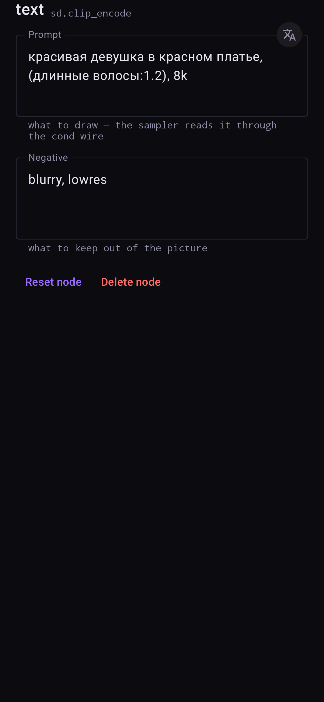
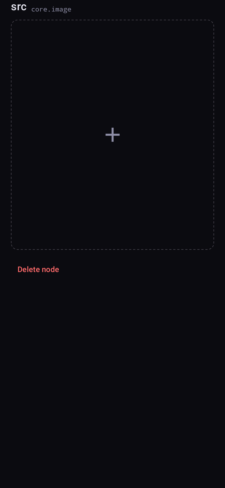

# Nodes and their settings

There are five kinds of node. Every flow — ready-made or yours — is built from these.

| node | palette tab | inputs | output |
|---|---|---|---|
| [Prompt](#prompt) | Common | — | prompt |
| [Image](#image) | Common | — | image |
| [Image generator](#image-generator) | Generate | prompt, image (+ reference) | image |
| [Inpaint generator](#inpaint-generator) | Inpaint | prompt, image | image |
| [Video generator](#video-generator) | Generate | prompt, image | video |
| [Output](#output) | Common | media | — |

Every node's sheet ends with **Reset node** (all settings back to default) and **Delete node**.
Double-tap a node's name in its sheet to rename it.

---

## Prompt

Holds the text. Both boxes are shown on the node itself; tap one to edit it.

| setting | what it does |
|---|---|
| **Prompt** | What to draw |
| **Negative** | What to keep out of the picture (ignored at CFG 1 — FLUX.2, Z-Image, Qwen Image) |

A token count under each box tells you how much of the model's prompt limit you have used.
If the prompt is in **Russian or Chinese**, a **文A** button translates it to English on the
phone; the same button undoes it. See [Settings → Translation](settings.md#translation).

<figure markdown>
  { .screen }
</figure>

## Image

A photo from your gallery. Tap **Choose** to pick one (**Change** once there is one); it appears on the node
straight away, no Run needed. The picture's own buttons swap it or clear it.

<figure markdown>
  { .screen }
</figure>

## Image generator

The node that makes the picture. Its **title follows what is wired into it**:

| wired in | title |
|---|---|
| prompt only | *Text to image* |
| prompt + image | *Image to image* — or *Image edit* on FLUX.2 and Qwen Image |
| prompt + reference | *Image edit* (FLUX.2 and Qwen Image) |

The palette card is **Image** with a chip per family — **SD 1.5**, **SDXL**, **Anima**,
**FLUX.2**, **Z-Image**, **Qwen Image**. The family decides which settings appear.

| setting | families | what it does |
|---|---|---|
| **Checkpoint** | all | The model. Switching family rewrites the node and keeps its wires |
| **Steps** | all | Refinement passes. Opens on the model's own recommended value |
| **CFG** | all | How strictly the prompt is followed. FLUX.2, Z-Image and Qwen are made for **1** — above 1 the negative prompt is read, but the picture burns quickly |
| **Seed** | all | `0` = a new picture every Run. Type a seed shown on a node to get that one back |
| **Scheduler** | all | The sampling method; a distilled model usually wants its author's choice. DiT models always use Euler |
| **Karras sigmas** | SD 1.5, SDXL, Anima | An alternative noise schedule (not with LCM) |
| **Denoise** | with an image | How much of the photo is replaced — 0 keeps it, 1 replaces it. Image to image opens at 0.65, Image edit at 1.0 |
| **Resolution** | SD 1.5 | The sizes this model supports. A new size reloads the model on the next Run |
| **Shape** | SDXL, Anima | Crops the fixed 1024 square to an aspect. No reload |
| **Width**, **Height** | FLUX.2, Z-Image, Qwen | 512–2048 in 64-pixel steps. No reload |
| **LoRAs** | FLUX.2, Z-Image | Adapters on top of the model, each with a strength. [LoRAs](../models/loras.md) |
| **Crop** frame | with an image | Which part of the photo is used. Tap the picture on the node to frame it |
| **Pad** | with an image | What fills the frame where it runs off a small photo: **Black**, **Blur**; edit models also **Green** |
| **Allow padding** | FLUX.2, Qwen (edit) | Lets the frame zoom out past the photo; the padding is generated |
| **Reference** region | FLUX.2, Qwen | Which part of the reference picture is used |

The **bars icon** beside Seed, Steps, CFG, Denoise and Scheduler arms that setting for a
[batch](../flows/batch.md).

## Inpaint generator

Everything the image generator has, plus the mask. Families: **SD 1.5**, **SDXL**, **Anima**.

| setting | what it does |
|---|---|
| **Mask** | The area to repaint. [Inpaint](../flows/inpaint.md#the-mask-editor) |
| **Only masked** | *On (default):* work on a crop around the mask — more detail where you painted |
| **Stitch to original image** | *Off (default):* the result is the frame you chose. *On:* pasted back into the whole photo |
| **Grow** | Widen or narrow a tapped or picked area |
| **Feather** | Soften the mask's edge |
| **Enable tap to select** | Tap an object in the mask editor to select it (Segment Anything, 87 MB) |
| **Enable auto mask** | Pick Clothes, Face, Hair, Shoes or Bag by name (29 MB); the flow remembers it |
| **Enable Add Objects** | Paste objects from another photo and repaint only their edges. [Add Objects](../flows/add-objects.md) |
| **Pad** | Black, Blur or Green, for frames that run past the photo (outpainting) |

The three *Enable* boxes remember how you last left them: a new Inpaint node starts the same way.

## Video generator

The text- and image-to-video model. Needs the video models (Models → Video).

| setting | what it does |
|---|---|
| **Seed** | `0` = a new clip every Run |
| **Upscale** | *On (default):* 2× to 1024 × 640. *Off:* 512 × 320, a little faster |
| **Crop** frame | With a photo wired in: which part is animated |

## Output

Where the result lands. It shows the picture or clip; tap it to see it full screen.

| setting | what it does |
|---|---|
| **Autosave** | *On (default):* every Run is kept in Results with the flow that made it |
| **Auto upscale** | Enlarge the result before keeping it. The node then shows what it received above what it made |
| **Upscaler** | Which upscaler to use — install them under Models → Upscalers |
| **Scale** | 2×, 3× or 4×. A result that would pass 4096 px gets the largest scale that fits |
| **Save** (video) | Also write the MP4 to `Movies/Nightmare` |
