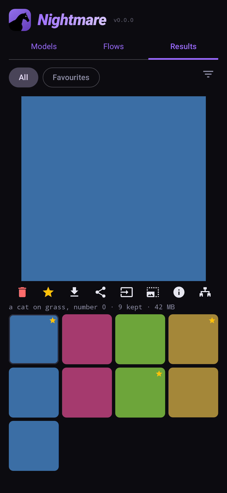
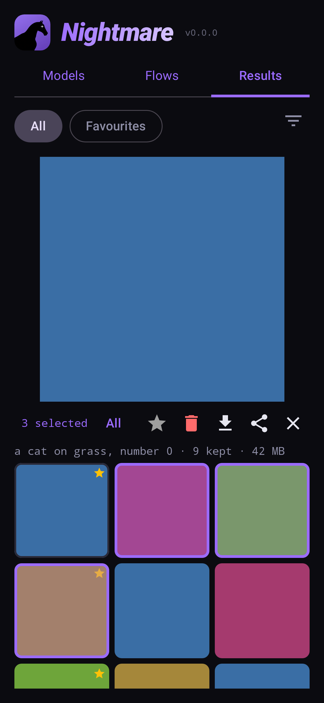

# Results

**Results** (top of the screen) holds everything you have made, newest first. Each picture is
kept **together with the flow that made it** — prompt, model, seed, every setting — so you can
always get back to exactly how it was made.

<figure markdown>
  { .screen }
</figure>

## Browsing

- **All** / **Favourites** switch between everything and the pictures you starred. The filter
  icon narrows the list further.
- A [batch](../flows/batch.md) is kept as one group: its pictures are shown together under one
  card.
- Tap a picture to show it large; tap the large one to see it full screen (pinch or double-tap
  to zoom).

## The picture's buttons

| button | does |
|---|---|
| 🗑 **Delete** | Removes it (asks first) |
| ★ **Favourite** | Stars it; starred pictures appear under **Favourites** |
| ⬇ **Save to gallery** | Writes a copy to your phone's gallery |
| **Share** | Shares the picture with another app |
| **Send to a flow** | Offers the flows that take a photo — Image to image, Inpaint, Image edit, Upscale, Image to video — and opens the one you pick with this picture in it |
| **Upscale** | Enlarges it with an upscaler; the bigger copy is kept as a new item |
| ⓘ **What made this** | The prompt, model, seed and settings |
| **Open flow** / share the flow | Reopens the flow that made it on the canvas, or shares that flow as a file |

A clip plays on its card; tap it to play it full screen.

## Selecting several

Long-press a picture to start selecting, then tap more. Save, share and delete then act on all
of them. The ✕ stops selecting.

<figure markdown>
  { .screen }
</figure>
