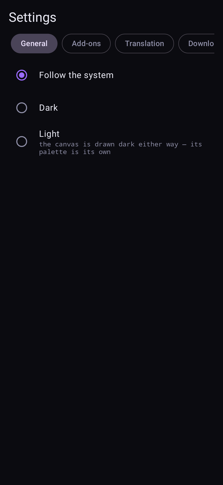
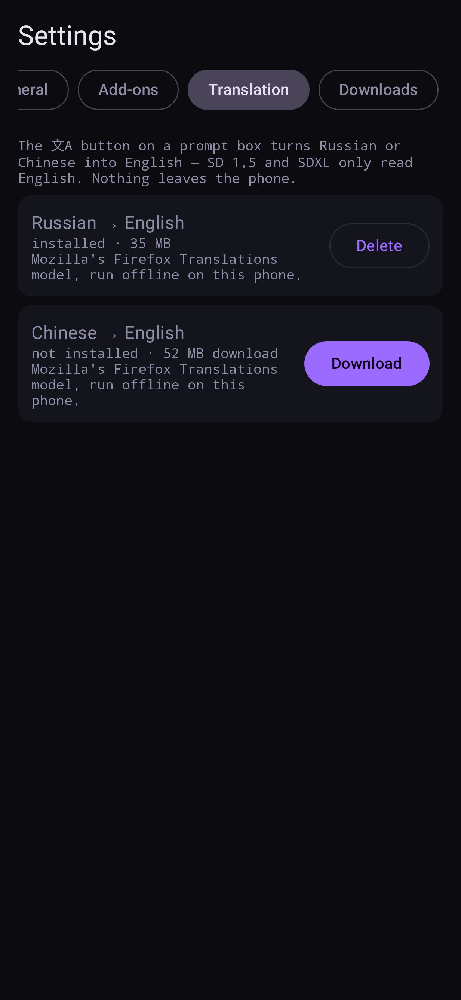
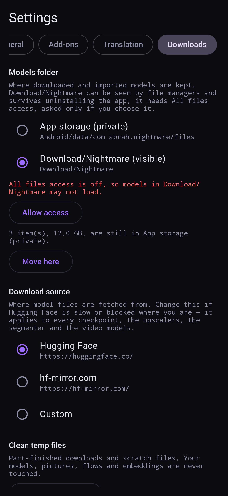

# Settings

Open Settings with the ⚙ gear at the top right of the canvas. It has four tabs: **General**,
**Add-ons**, **Translation** and **Downloads**.

## General

<figure markdown>
  { .screen }
</figure>

### Theme

**Follow the system**, **Dark** or **Light**. The canvas itself is always drawn dark; the theme
changes everything around it.

### Keep rendering in the background

Shown only when your phone's battery manager may stop the app while it is not on screen. Tap
**Allow in background** so a render in progress, or a loaded model, is not cut off when you
switch apps.

### Memory

Three switches, the same as LocalDream's. Their defaults are set **from your phone's RAM**.

| switch | default | what it does |
|---|---|---|
| **SDXL low RAM mode** | on under 16 GB, off at 16 GB+ | Loads each part of an SDXL model on demand and frees it after use. Required under 16 GB. Disables the live preview while it renders |
| **Anima low RAM mode** | on under 16 GB, off at 16 GB+ | The same, for Anima |
| **Anima DiT sequential loading** | off | Only with Anima low RAM mode: never keeps both halves of Anima's model in memory at once. Turn it on if you have 12 GB and Anima still cannot run. Slower per step |

Changing a switch takes effect on the next Run (a loaded model of that family is let go). More
in [Memory and speed](memory.md).

## Add-ons

- **LoRAs** — import `.safetensors` adapters for FLUX.2 and Z-Image; the list shows each one's
  size, and the bin deletes it. [LoRAs](../models/loras.md)
- **Embeddings** — import textual-inversion files and use them by name in a prompt.

## Translation

Nightmare can translate a **Russian or Chinese** prompt to English on the phone, offline — SD
1.5 and SDXL only read English. The **文A** button on a prompt box does it; the same button
undoes it. Weights like `(long hair:1.2)` and English tags pass through untouched.

This tab lists the two translation models (Mozilla's Firefox Translations: 37 MB for Russian,
55 MB for Chinese) with Download and Delete. If you tap 文A before a model is installed, the app
offers to download it and translates as soon as it lands. About 15 ms a prompt; nothing leaves
the phone.

<figure markdown>
  { .screen }
</figure>

## Downloads

<figure markdown>
  { .screen }
</figure>

### Models folder

Where downloaded and imported models are kept:

- **App storage (private)** — the default. Nothing else can see the files, and **uninstalling
  the app deletes them**.
- **Download/Nightmare (visible)** — any file manager can reach them and they survive an
  uninstall. Needs **All files access**, which is asked for only when you choose this.

Switching offers to **move** the models you already have, with the size, a progress bar and
Cancel; the phone needs free space for the largest model while it moves. Loading speed is the
same in either place.

### Download source

Where model files are fetched from: **Hugging Face** (default), **hf-mirror.com**, or a
**Custom** base address. Change it if Hugging Face is slow or blocked where you are — it applies
to every model, upscaler, segmenter, translation model and the video models.

### Clean temp files

Finds part-finished downloads and scratch files and deletes them after asking. Your models,
pictures, saved flows and embeddings are never touched. (An unfinished download then starts
again from the beginning.)
