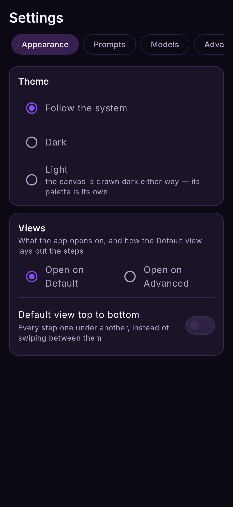
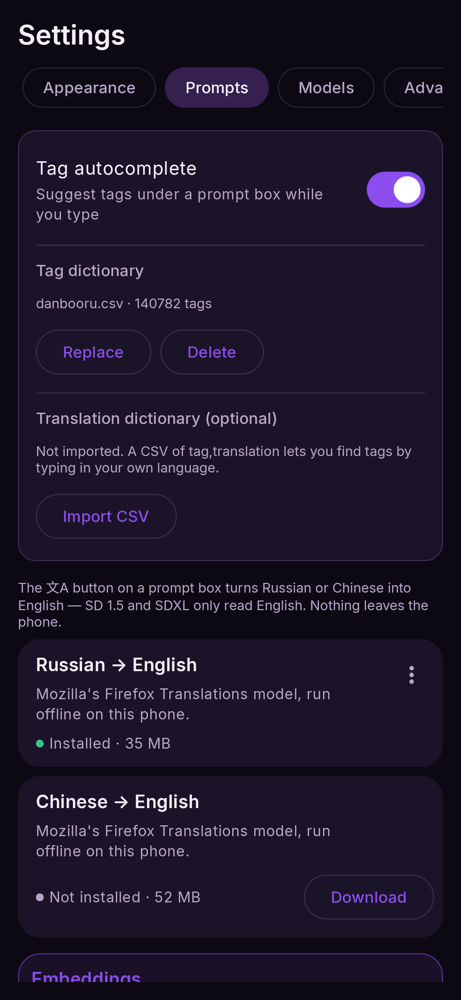
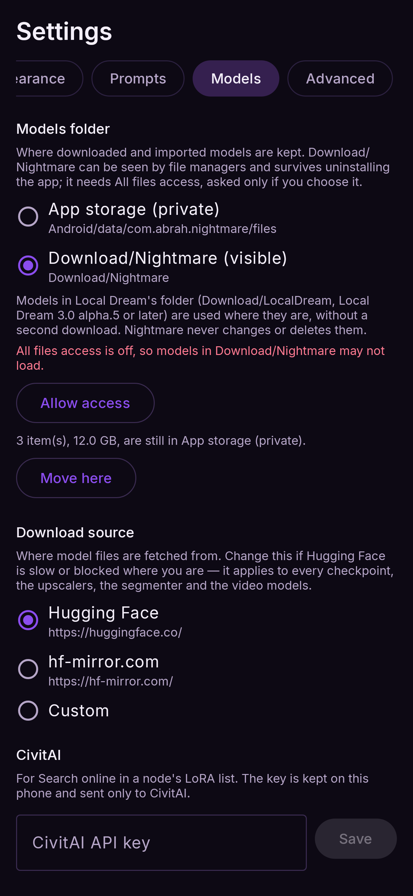
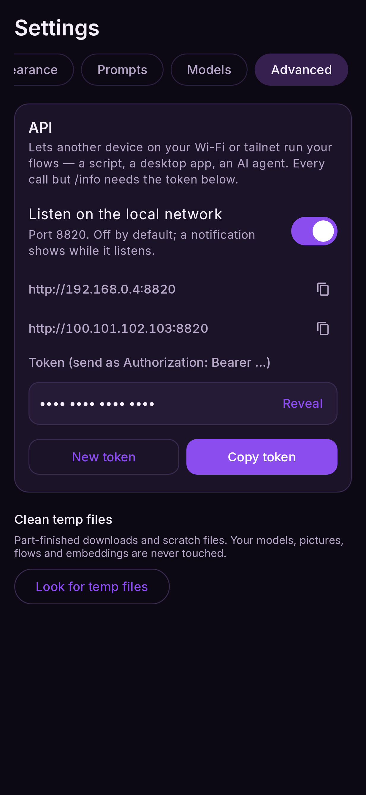

# Settings

Open Settings from the sidebar (☰ at the top left). It has five tabs: **Appearance**,
**Prompts**, **Models**, **Performance** and **Advanced**.

## Appearance

<figure markdown>
  { .screen }
</figure>

### Theme

**Follow the system**, **Dark** or **Light**. The canvas itself is always drawn dark; the theme
changes everything around it.

### Views

**Open on Default** or **Open on Advanced** — the view the app starts on (asked the first time).
**Default view top to bottom** shows every step one under another instead of swiping between them.
It changes the Default view only; the Advanced view's node sheet always swipes side to side.

## Prompts

<figure markdown>
  { .screen }
</figure>

### Tag autocomplete

While you type in a prompt box, matching tags appear under it as a row of chips, the most used
first; tap one to replace the word you were typing (`long ha` → `long hair, `). Tags with
brackets go in escaped, so `ganyu (genshin impact)` stays a name and not a weight.

- **Tag dictionary** — tap **Download** for Danbooru's tag list (3.4 MB, 140,000 tags with their
  aliases, from a1111-sd-webui-tagcomplete), or **Import CSV** to use your own in the same
  `tag,category,count,aliases` form. Suggestions are off until one is installed.
- **Translation dictionary** (optional) — **Import CSV** with `tag,translation` lines, and you can
  type in your own language to find a tag: `长发` suggests `long hair`.
- The switch turns suggestions off without deleting either dictionary.

### Translation

Nightmare can translate a **Russian or Chinese** prompt to English on the phone, offline — SD
1.5 and SDXL only read English. The **文A** button on a prompt box does it; the same button
undoes it. Weights like `(long hair:1.2)` and English tags pass through untouched.

This section lists the two translation models (Mozilla's Firefox Translations: 37 MB for
Russian, 55 MB for Chinese) with Download and Delete. If you tap 文A before a model is installed,
the app offers to download it and translates as soon as it lands. About 15 ms a prompt; nothing
leaves the phone.

### Embeddings

Import textual-inversion files and use them by name in a prompt. [Embeddings](../models/loras.md#embeddings)

## Models

<figure markdown>
  { .screen }
</figure>

### Models folder

Where downloaded and imported models are kept:

- **App storage (private)** — the default. Nothing else can see the files, and **uninstalling
  the app deletes them**.
- **Download/Nightmare (visible)** — any file manager can reach them and they survive an
  uninstall. Needs **All files access**, which is asked for only when you choose this.

**Local Dream's models are used where they are.** If you also use Local Dream (3.0 alpha.5 or
later) with its models in **Download/LocalDream**, Nightmare lists them, marked **Local Dream**, and
runs them from there without a second download. It never changes or deletes them — delete them in
Local Dream. This needs All files access, like Download/Nightmare.

Switching offers to **move** the models you already have, with the size, a progress bar and
Cancel; the phone needs free space for the largest model while it moves. Loading speed is the
same in either place.

### Download source

Where model files are fetched from: **Hugging Face** (default), **hf-mirror.com**, or a
**Custom** base address — tap **Custom**, type the address (it starts as `https://`), and it is
saved when you press Done or leave the field. Change it if Hugging Face is slow or blocked where you are — it applies
to every model, upscaler, segmenter, pose detector, depth estimator, ControlNets, translation model, the describe and tagger models, the tag dictionary and the video models.

### CivitAI

Used by **Search online** in a node's LoRA list ([LoRAs](../models/loras.md)):

- **CivitAI API key** — most CivitAI LoRAs download only with your own free key (civitai.com →
  Account settings → API Keys). It is kept on this phone and sent only to CivitAI.
- **Show mature content** — off by default. When on, searches go to civitai.red, which
  includes NSFW LoRAs and previews.

### LoRAs

Import `.safetensors` adapters; the list shows each one's size, and Delete removes it.
[LoRAs](../models/loras.md)

## Performance

### Memory

Three switches, the same as LocalDream's. Their defaults are set **from your phone's RAM**.

| switch | default | what it does |
|---|---|---|
| **SDXL low RAM mode** | on under 16 GB, off at 16 GB+ | Loads each part of an SDXL model on demand and frees it after use. Required under 16 GB. Disables the live preview while it renders |
| **Anima low RAM mode** | on under 16 GB, off at 16 GB+ | The same, for Anima |
| **Anima DiT sequential loading** | off | Only with Anima low RAM mode: never keeps both halves of Anima's model in memory at once. Turn it on if you have 12 GB and Anima still cannot run. Slower per step |

Changing a switch takes effect on the next Run (a loaded model of that family is let go). More
in [Memory and speed](memory.md).

### Keep rendering in the background

Shown only when your phone's battery manager may stop the app while it is not on screen. Tap
**Allow in background** so a render in progress, or a loaded model, is not cut off when you
switch apps.

## Advanced

<figure markdown>
  { .screen }
</figure>

### API

**Listen on the local network** lets another device on your Wi-Fi or tailnet run your flows —
off by default. When on, it shows the address and the token to use. [Local API](api.md)

### Clean temp files

Finds part-finished downloads and scratch files and deletes them after asking. Your models,
pictures, saved flows and embeddings are never touched. (An unfinished download then starts
again from the beginning.)
