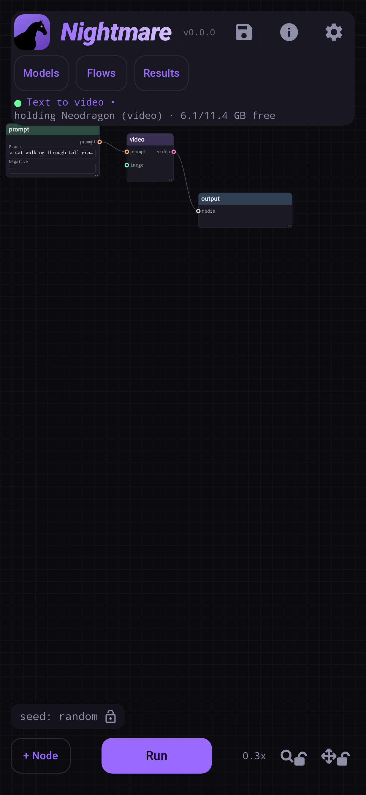
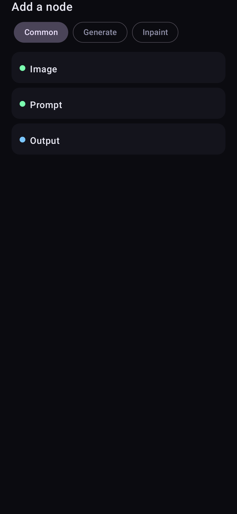
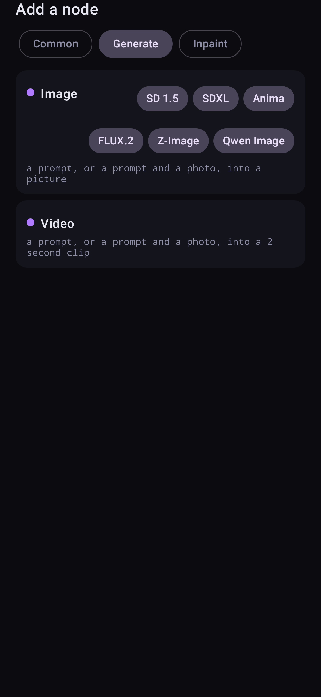
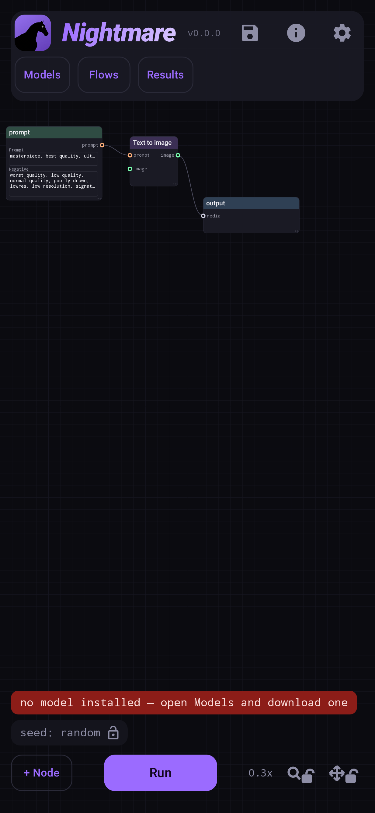

# The canvas

The canvas is the main screen: the flow you are working on, drawn as nodes and wires, with the
controls around it.

<figure markdown>
  { .screen }
  <figcaption>Top bar, the flow, and the run bar at the bottom.</figcaption>
</figure>

## The top bar

| control | what it does |
|---|---|
| **Models** | Download, switch and delete models. [Models](../models/index.md) |
| **Flows** | Ready-made flows (**Recommended**) and your own (**Saved**). [Flows](../flows/index.md) |
| **Results** | Every picture and clip you have made, with the flow that made it. [Results](../reference/results.md) |
| 💾 (save) | Save this flow under a name. It is pre-filled with the flow it came from. |
| **ⓘ** | This phone's chip and NPU. [Install](install.md#check-what-your-phone-can-run) |
| ⚙ (gear) | Settings. [Settings](../reference/settings.md) |

The line under the buttons tells you the state of things:

- the flow's name, or **unsaved flow** with a dot when it has changes that are not saved;
- the model that is loaded and whether it is busy, e.g. `AbsoluteReality (idle)`;
- how much memory the phone has free, e.g. `4.9/11.7 GB free`.

## Nodes and wires

A **node** is one step. Its title bar says what it is; its body shows its picture, prompt or a
short summary. Dots on the left edge are **inputs**, dots on the right are **outputs**, and a
**wire** carries a result from an output to an input. The dot colour tells you what kind of
thing travels on it (a prompt, a picture, a video).

There are only five kinds of node — see [Nodes and their settings](../reference/nodes.md):

- **Prompt** — the text.
- **Image** — a photo from your gallery.
- **Image** / **Inpaint** generators — the model that makes the picture. Its title follows what
  is wired into it: *Text to image*, *Image to image*, *Image edit* or *Inpaint*.
- **Video** — the video generator.
- **Output** — where the result lands, is kept and (optionally) enlarged.

## Gestures

| gesture | does |
|---|---|
| Tap a node | Opens its settings in a sheet |
| Drag a node | Moves it |
| Drag the bottom-right corner of a node | Resizes it (a bigger node shows more of its prompt) |
| Drag empty space | Pans the canvas |
| Pinch | Zooms |
| Drag from an output dot to an input dot | Connects them with a wire |
| Tap a wire, then tap the bin at its middle | Deletes the wire (a double tap on the middle of a wire does both) |
| Long-press a node | Starts **multi-select**: tap more nodes, then delete them together |
| Tap a picture on a node | Shows it full screen |

The two padlocks at the bottom right lock the **zoom** (magnifier) and the **panning**
(four-way arrow) separately, so a pinch or a stray drag cannot move the view while you work.
The number beside them is the zoom level.

!!! tip "A wire that would make a loop is refused"
    While you drag a wire, it turns red if connecting it would be refused (for example a wire
    that would make the flow run in a circle). The reason stays in the bar at the bottom.

## The node sheet

Tapping a node opens its **sheet**: every setting that node has, explained under each control.
Along the top of the sheet is every node in the flow, in the order they run; tap one, or swipe
sideways, to move to the next without closing. Pull the sheet down to close it.

At the bottom of each sheet, **Reset node** puts every setting back to its default and
**Delete node** removes it (it asks first, and names what it would remove).

## Adding nodes

**+ Node** opens the palette in three tabs:

- **Common** — Image, Prompt, Output.
- **Generate** — the **Image** generator (with a chip per model family) and **Video**.
- **Inpaint** — the Inpaint generator, per family.

The new node appears in the middle of the screen. Wire it in, set it up, and Run.

<figure markdown>
  { .screen }
</figure>
<figure markdown>
  { .screen }
</figure>

## Running

**Run** runs the whole flow. Nodes whose settings and inputs have not changed since the last
Run are **not** run again — change the prompt, and only the generator and what follows it runs.

While it runs, the **run log** above the button shows:

- the node running now and its progress as a percentage;
- each finished node and how long it took;
- the total time once it is done.

The ✕ hides the log (it does not stop the run). The copy button copies the whole log — paste it
into a bug report. To **stop** a render, tap **Cancel** on the Run button.

If a node fails, it turns red and says why underneath itself, and everything after it is shown
as blocked.

<figure markdown>
  { .screen }
</figure>

## The seed chip

`seed: random` means every Run makes a new picture. Tap the **padlock** to lock the seed of
the last picture: from then on every Run starts from that same noise, so you can change the
prompt or a setting and see only the effect of that change. Tap again to unlock.

## Saving your work

The canvas saves itself as you go — close the app and it reopens where you left it, zoom and
position included. To keep a flow for later, tap 💾 and name it; it then appears under
**Flows → Saved**. Flows can also be shared as a `.json` file and imported with
**Import a flow** at the bottom of the Flows tab.
