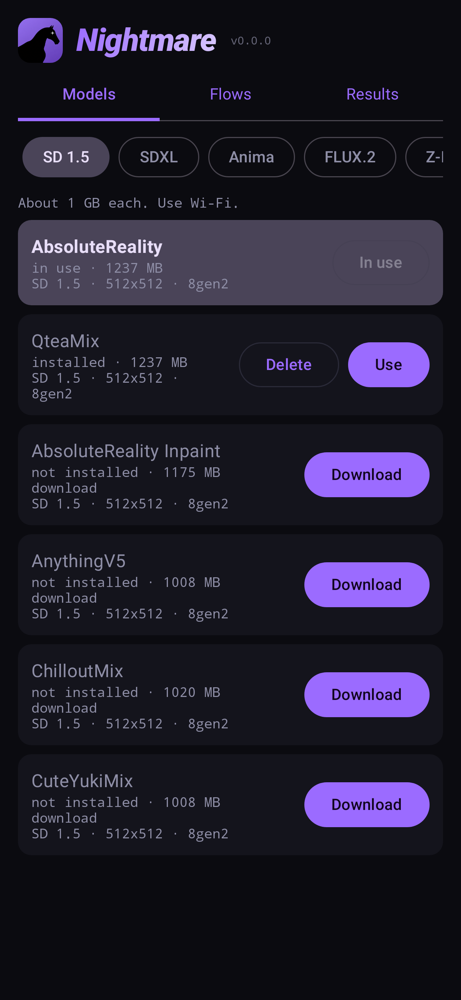

# Your first picture

This walkthrough uses **AbsoluteReality**, a realistic SD 1.5 model that runs on every
supported phone. It is about 1.2 GB — use Wi-Fi.

## 1. Download a model

1. Tap **Models** at the top of the screen.
2. The **SD 1.5** tab is open. Find **AbsoluteReality** and tap **Download**.
   A progress bar shows the size and how far it has got; **Cancel** stops it.
3. When it finishes, tap **Use**. The row now says **In use**.

<figure markdown>
  { .screen }
  <figcaption>Each row shows the model's size, the size it draws at, and the build your chip gets.</figcaption>
</figure>

Close the panel by pulling it down (drag from the top of it towards the bottom of the screen).
Every panel in the app closes this way, and so does **Back**.

## 2. Open the Text to image flow

1. Tap **Flows**. The **Recommended** tab lists the ready-made flows.
2. Tap **Text to image**. It opens on the canvas: a **prompt** node, a **Text to image**
   node and an **output** node, already wired.

## 3. Write what you want

Tap the **prompt** node. A sheet slides up with two boxes:

- **Prompt** — what to draw. For SD 1.5 models, short comma-separated phrases work best:
  `a red fox in snow, morning light, detailed fur`.
- **Negative** — what to keep out: `blurry, low quality, watermark`.

The boxes already hold a starting prompt suited to the model. Replace it with your own and pull
the sheet down.

## 4. Run

Tap **Run**. A log above the button shows what is happening — the node running, a percentage,
and each finished node's time. On a recent phone an SD 1.5 picture takes a few seconds; the
very first Run also loads the model, which adds a few more.

The picture appears **on the output node**. Tap it to see it full screen: pinch or double-tap
to zoom, and use the buttons to save it to the gallery, share it, or keep it in favourites.

## 5. Make another

Every Run makes a **new** picture, because the seed is random (the chip above Run says
`seed: random`). If you like one and want to keep working on *that* picture — changing the
prompt a little, for example — tap the **padlock** on that chip. The seed of the last picture is
locked and every Run starts from it until you unlock it.

!!! success "Every picture is kept"
    Each result is saved in **Results** together with the flow that made it, so you can always
    go back and reopen the exact settings. See [Results](../reference/results.md).

## Where next

- Try a different model — each family has its own style. [Models](../models/index.md).
- Start from a photo instead: [Image to image](../flows/image-to-image.md).
- Learn the canvas properly: [The canvas](canvas.md).
